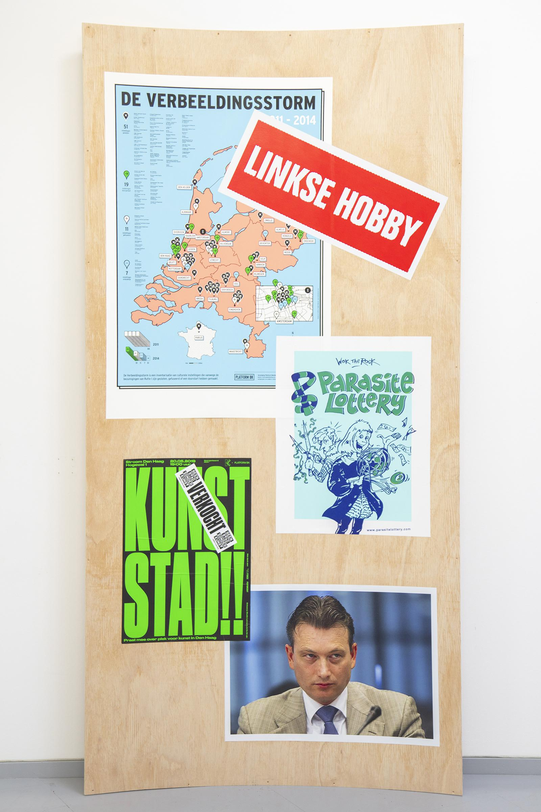

---
Pr-id: INC Theory on Demand #49
P-id: INC Theory on Demand
A-id: 49
Type: article
Book-type: anthology
Anthology item: article
Item-id: unique no.
Article-title: De bevrijding van het mecenaat
Article-status: accepted
Author: Liesbeth Bik, Helleke van den Braber, Timo Demollin, Nous Faes, Roel Griffioen, Anna van Leeuwen, Sofia Patat, Jack Segbars, Renée Steenbergen, Olav Velthuis
Author-email:   corresponding address
Author-bio:  about the author
Abstract:   short description of the article (100 words)
Keywords:   50 keywords for search and indexing
Rights: CC BY-NC 4.0
...

# De waarde(n) van geld

### Sofia Patat

> 'Money and language have something in common: they are nothing and
> they move everything. They are nothing but symbols, conventions,
> flatus vocis, but they have the power of persuading human beings to
> act, to work, to transform physical things.' - *Franco Berardi, The
> Uprising: On Poetry and Finance (2012)*

Vanwaar die negatieve instelling in de kunstenwereld tegenover private
middelen? Onder de vrees voor verlies van artistieke autonomie
verschuilt zich een dieperliggend waardenconflict. Gelukkig is er één
figuur die daar wel raad mee weet. Kan de fundraiser de kunsten redden?

Twee recent gepubliceerde onderzoeken over de economische situatie van
beeldende kunstenaars stellen dat 64% van de Nederlandse en Belgische
kunstenaars niet kan leven van zijn artistieke praktijk.[^03_1] Zelfs als
we het werk dat verricht is buiten de kunsten meerekenen, slaagt 25% er
nog niet in om financieel rond te komen. 50% van de ondervraagden moet
leven met een gemiddelde jaarlijkse inkomen lager dan 10.000 euro.
Kunstenaars spreken van 'een gevecht met armoede, onzekerheid en
precariteit'.[^03_2] Al staat rijk zijn wellicht niet bovenaan de
prioriteitenlijst van onafhankelijke beeldende kunstenaars, toch is het
wel zeker dat geld (of eerder het ontbreken daarvan) hun geest in beslag
neemt.

Tegelijkertijd lijken kunstenaar geld als iets\... onwaardig te
beschouwen. Ze vinden het makkelijker om te praten over het geld waar
het hen aan ontbreekt, dan over het geld dat ze verdienen. Volgens
kunstenaar en socioloog Hans Abbing blijken alle termen die verwijzen
naar geld en handel -- geld, markt, commodity, commercieel, commercie,
marketing -- bij kunstenaars negatieve gevoelens op te roepen.[^03_3]

De kunstsector als geheel lijkt deze houding te onderschrijven.
Kunstenaars die een zakelijke aanpak tonen om vergoedingen of
verkoopsprijzen te versieren, krijgen snel de reputatie van
\'commerciële kunstenaars'. En \'commercieel\' is waarschijnlijk ook de
meest gebruikte vorm van smaad binnen de kunstkritiek. 'Veel kunstenaars
(maar ook andere agenten in de kunstwereld) hebben een complexe relatie
met de markt', schreef Maaike Lauwaert al in 2011. 'Te commercieel
succesvol zijn wordt met argwaan bekeken en wordt beschouwd als het
resultaat van het maken van concessies als kunstenaar.'[^03_4] In die lijn
lijkt de artistieke waarde van kunstwerken juist te stijgen met de
minachting van de kunstenaar voor hun economische waarde en voor de
markt als geheel.

Volgens onderzoek van economisch en cultureel socioloog Olav Velthuis is
het onder kunstgaleries een wijdverspreide praktijk om prijzen niet
openlijk te bespreken, maar het gesprek rond kunst duidelijk te scheiden
van de financiële onderhandeling. Om de heilige symboolwaarde van kunst
te blijven waarborgen, praten galeriehouders alleen achterin hun galerie
over geld, of in een kleine ruimte die daar specifiek voor gereserveerd
is. Ze voeren dus een fysieke scheiding in tussen de museale *front
space* en de zakelijke *backoffice* van galeries.[^03_5]

## Weerzin tegen privaat geld

We kunnen wellicht spreken van een sector-brede minachting voor geld. Of
eerder voor privaat geld. Tegenover publiek geld bestaat veel minder
vijandigheid. Kijk naar alle protest van de kunstgemeenschap tegen
bezuinigingen op de cultuurbegroting. De argumentatie luidt dan vaak dat
kunst een sociale noodzaak is, een basisbehoefte die de samenleving
vitaal en kritisch houdt en zelfreflectie stimuleert. Financiële
ondersteuning van kunst wordt dan ook gezien als een
verantwoordelijkheid van de overheid. Private financiering alleen, zo
wordt betoogd, zou niet volstaan, aangezien het *strings attached* heeft
en onderworpen is aan individuele voorkeuren en zakelijke belangen.
Alleen een zorgzame en rechtvaardige overheid zou kunstenaars in staat
stellen vrijelijk te functioneren en zich te beschermen tegen externe
druk.

Het argument is niet alleen dat private middelen onmogelijk de
verminderde publieke financiering kunnen compenseren, maar ook dat
private middelen artistieke vrijheid, onafhankelijkheid en experiment
zouden beperken. Private financiering geeft, zo wordt beweerd, de
voorkeur aan gemakkelijke, toegankelijke kunst: kunst die meer geschikt
is voor de markt en minder kritisch, provocerend en experimenteel is.

Daaronder schuilt de breed gedeelde aanname dat patronen en sponsoren
invloed zouden uitoefenen op de tentoonstellings- en acquisitiekeuzes.
Dat ze zouden proberen om artistieke beslissingen te beïnvloeden in het
voordeel van hun eigen zakelijke belangen. Dat geldschieters in ruil
voor hun donaties zouden eisen dat werken uit hun privécollectie
tentoongesteld worden, om daarmee hun waarde te verhogen. Bovendien, zo
hoor je vaak, geven zakelijke en particuliere donateurs liever de
voorkeur aan gevestigde talenten en reeds succesvolle organisaties, ten
koste van opkomende kunstenaars en onafhankelijke kunstinstellingen.

Van die ongepaste beïnvloeding (of pogingen daartoe) bestaan natuurlijk
wel degelijk voorbeelden. Na de financiële ineenstorting van het Los
Angeles Museum of Contemporary Art in 2012, werd Trustee Eli Broad
beschuldigd de kandidatuur van kunsthandelaar Jeffrey Deitch als
museumdirecteur te hebben opgedrongen, om indirect de programmering van
het museum te sturen naar een meer commerciële koers.

In Nederland was er in 2005 de veelbesproken sponsorovereenkomst tussen
het Stedelijk Museum Amsterdam en ABN AMRO.[^03_6] Gelijktijdig met de
ondertekening werd bankier Rijkman Groenink, bestuursvoorzitter van ABN
AMRO, ook hoofd van de Raad van Toezicht van het museum. Dat gaf hem het
recht om de museumdirecteur te benoemen of te ontslaan, en de
jaarrekeningen en strategische plannen van het museum goed of af te
keuren. Voortaan kon hij ook de benoeming van andere leden van die Raad
van Toezicht beïnvloeden. In de Verenigde Staten is dat trouwens een
veelvoorkomende praktijk. Om tot het bestuur van musea en
kunstinstellingen te mogen toetreden, wordt regelmatig een financiële
bijdrage gevraagd.

## Sturende subsidies

Maar zelfs in het licht van deze voorbeelden lijkt de stelling dat
artistieke autonomie enkel gewaarborgd kan worden door
overheidsfinanciering, geen stand te houden. Ook subsidies streven naar
specifieke doelen en geven de voorkeur aan bepaalde kunstvormen en
projecten boven andere. Kunstsubsidies dienen evenzeer om cultureel
beleid uit te voeren. In Nederland hoeven we alleen maar te kijken naar
het recente advies van de Raad voor Cultuur aan het Ministerie van
Cultuur over de Basisinfrastructuur 2017-2020. Onder de
evaluatiecriteria vallen bijvoorbeeld 'maatschappelijke relevantie',
'diversiteit' en 'participatie'.[^03_7]

In dit verband spreekt Belfiore van een *\'instrumental turn\'* die het
Britse cultuurbeleid in de jaren 1980 overnam, om zich later over heel
Europa te verspreiden.[^03_8] Ook overheden neigen ertoe om met de
financiering van cultuur doelen te bereiken op andere gebieden dan het
culturele: stadsvernieuwing en lokale economische ontwikkeling,
maatschappelijke integratie, gemeenschapsontwikkeling en sociale
cohesie, veiligheid, gezondheidszorg, werkgelegenheid, onderwijs. En in
die verwachtingen zijn publieke financiers zeker niet minder streng dan
particuliere financiers. Ze hebben alleen andere doelstellingen en
andere resultaten op het oog. Maar geld heeft altijd *strings attached.*

Waar sta je dan met je autonomie? Je kan je afvragen of absolute
artistieke autonomie überhaupt nog een realistische ambitie is in de
hyper-vernetwerkte en geglobaliseerde kunstwereld van vandaag,
gedomineerd door een sterke kunstmarkt en een steeds neoliberaler
cultuurbeleid. Op de ene of de andere manier moet elke professionele
kunstenaar of kunstorganisatie tot compromissen komen om zijn werk te
ondersteunen. Een kunstenaar zal een paar verkoopbare tekeningen
produceren om minder courant werk te financieren. Een museum zal af en
toe een populair tentoonstellingsonderwerp kiezen om daarnaast meer
experimentele projecten te kunnen ondersteunen.

## De morele lading van geld

In plaats van een kwestie van artistieke autonomie lijkt de vijandigheid
tegenover private financiering veeleer de uitkomst van een
waardenconflict en van een steeds wijder verspreid bewustzijn over de
gevolgen van kunstfinanciering -- niet alleen de artistieke gevolgen,
maar ook de morele en politieke implicaties. Geld draagt ​​een morele
lading: het is belegd met de waarden en ambities van degenen die het
geven.

Recente voorbeelden van zulke waardenconflicten zijn de protestacties
tegen Tate vanwege de sponsorovereenkomst met energiemultinational BP,
die verantwoordelijk was voor de ecologische ramp op olieplatform
Deepwater Horizon in 2010, en de kunstenaars-boycot van de Sydney
Biënnale van 2014 omwille van haar relatie met Transfield, een bedrijf
dat betrokken is bij het beheren van vluchtelingendetentiecentra. Niet
de vermeende invloed van de sponsoren op de artistieke programmering
werd gewraakt, wel de morele implicaties van hun partnerschappen met het
kunstenveld.

Dezelfde redenering geldt voor publieke financiering door autoritaire
regeringen. Zo initieerden kunstenaars en curatoren de afgelopen jaren
verschillende petities tegen de financiële steun van landen met een
twijfelachtig burgerrechtenbeleid. De Europese biënnale Manifesta kan
erover meespreken. Toen er besloten werd om de tiende editie van de
biënnale in 2014 in Rusland te organiseren, regende het felle kritiek.
In hetzelfde jaar was er zoveel ophef over een donatie van het
Israëlische consulaat in Sao Paolo aan de Sao Paolo Biënnale, dat het
logo van het consulaat verwijderd moest worden van de *sponsor board*
van de tentoonstelling.

## Botsende waarden en werelden

Waaruit bestaan zulke waardenconflicten dan precies? De Franse
sociologen Boltansky en Thévenot identificeren in hun publicatie *De la
justification* zes verschillende \'werelden\', zes domeinen waarbinnen
individuen opereren volgens telkens een ander *\'value regime\'*.[^03_9]
Zo'n waardenregime is een coherente groep waarden en criteria om dingen
en acties mee te beoordelen. Elk regime geeft de voorkeur aan andere
specifieke kenmerken en gedrag.

Als kunstenaars en kunstprofessionals vijandig staan tegenover private
financiers, dan komt dat volgens mij doordat zij in twee verschillende
waardensferen opereren: de artistieke sfeer aan de ene kant en die van
de markt aan de andere kant. Beide werelden delen weinig
gemeenschappelijke kenmerken en werken volgens contrasterende logica's.
Binnen de wereld van kunstenaars en kunstinstellingen zijn
zelfstandigheid, creativiteit, gemoedelijkheid en zelfverwerkelijking
kernwaarden.[^03_10] De zakelijke wereld daarentegen wordt geregeld door
(financiële) uitwisseling en wordt -- over het algemeen -- gedomineerd
door kernwaarden zoals concurrentie, winstbejag, emotionele afstand en
financieel succes.[^03_11] Dat zijn waarden waartegen kunstenaars zich
altijd hebben verzet.

Dat kunstenaars minder verzet tonen tegenover *overheidsfinanciering*,
ligt wellicht aan het feit dat de overheid wordt geleid door waarden die
kunstenaars in principe niet tegenstaan: collectieve
verantwoordelijkheid, sociale relaties, gelijkheid en sociale cohesie.
En daarnaast heb je ook nog de wereld van particuliere begunstigers. Die
vormt een geval apart, afhankelijk van ieders persoonlijke kenmerken en
motieven. Sommige begunstigers handelen net als bedrijven: zij doneren
kunstwerken aan musea om de waarde van hun eigen collectie en hun
persoonlijke invloed en prestige te vergroten. Anderen zijn veel
onzelfzuchtiger, worden niet geleid door overwegingen van persoonlijk
voordeel en houden zich bewust op afstand van artistieke beslissingen.

Mijn hypothese is dat conflicten en protesten rond financieringskeuzes
optreden wanneer er sprake is van een *mismatch* tussen de waarden van
de begunstiger en die van de begunstigde. Zulke *mismatches* komen zeker
niet exclusief voor bij private financiering. Daar zijn namelijk ook
heel succesvolle voorbeelden te vinden. Niet zozeer de herkomst van het
geld is bepalend, wel de waarden die ermee verbonden worden.

## De kunst van fondsenwerven

Bestaat er een uitweg uit dat waardenconflict? Een mogelijke -- hoewel
niet onfeilbare -- oplossing zie ik liggen in het inzetten van bekwame
fondsenwervers. De figuur van de professionele *fundraiser* zag het
levenslicht in de VS in het begin van de twintigste eeuw, maar deed in
de culturele sector pas zijn intrede in de jaren 1970, toen de
financiële crisis en de bijhorende krimpende overheidsbegrotingen ervoor
zorgden dat musea sterker afhankelijk werden van private middelen.
Sindsdien heeft culturele fondsenwerving zich sterk ontwikkeld en
geprofessionaliseerd. Recent is ze zelfs opgenomen in universitaire
curricula.

Kenmerkend aan fondsenwervers is dat ze bekend zijn met de waarden,
motivaties, doelstellingen en criteria die de keuzes van financiers
leiden. Zij zijn ook in staat aan deze waarden te appelleren wanneer zij
proberen om financiering veilig te stellen. Tegelijkertijd verzoenen zij
de voorwaarden en de verzoeken van private en publieke financiers op
zo'n manier dat de artistieke kwaliteit niet in gevaar komt. Ze fungeren
als *match makers* tussen artistieke staf en externe belanghebbenden.

De kerncompetentie van de fondsenwerver is dus dat hij zich weet aan te
passen aan diverse contexten, door zich vlot tussen al die sferen te
bewegen en zijn register steeds af te stemmen op dat van zijn
gesprekspartner. Een goede fondsenwerver is vooral een netwerker, een
manager van relaties. Hij is zich bewust van de verwachtingen van alle
partijen en brengt die samen op een manier die iedereen tevreden stelt
(of dat tenminste probeert).

Hoe dat concreet in zijn werk gaat? Vanuit een goed begrip van de
artistieke ambities, kernwaarden en toekomstplannen van de organisatie
waarvoor hij werkt, screent de fondsenwerver de motivatie, kernwaarden
en persoonlijke, institutionele of financiële doelstellingen van
potentiële begunstigers: sponsoren, stichtingen, particulieren en
overheidsinstanties. De keuze van de juiste *potentials* is een
belangrijke stap, omdat het de integriteit en de reputatie van de
organisatie beschermt, de kans op een succesvolle en langdurige
samenwerking verhoogt en het risico van conflict en onbegrip
minimaliseert.

De finale (en meest creatieve) stap van een succesvol proces is de
onderhandeling over de voorwaarden van de overeenkomst en de
tegenprestatie. Dit is ook het moment waarop het mis kan gaan. Denk aan
de (in eerste instantie) stukgelopen sponsoringsdeal tussen het
Stedelijk Museum Amsterdam en Audi in 1999, toen Audi de eis stelde dat
het zijn auto\'s in het museum zou kunnen presenteren. Het is de rol van
de fondsenwervers om de aspiraties van financiers te concretiseren,
zonder afbreuk te doen aan de artistieke koers van de organisatie. Ook
achteraf blijft de fondsenwerver zich engageren voor de tevredenheid van
beide partijen, de afwikkeling van eventuele meningsverschillen en het
veiligstellen van een hernieuwing van de overeenkomst.

## Conclusie

Op zich hoeft de vijandigheid van de kunstwereld tegenover private
middelen niet te verwonderen. Giften en donaties zijn immers nooit
vrijblijvend. Geld belichaamt de motivaties, waarden en ambities van
degenen die het schenken. En de waarden van zakelijke sponsoring staan
-- in de ogen van de kunstgemeenschap -- op gespannen voet ​​met die van
de onafhankelijke kunstenaar.

Alleen is het niet zo dat publieke subsidies wél zo neutraal zijn als de
kunstwereld lijkt te geloven. Overheden streven vooral waarden na
waarmee de kunstwereld meer affiniteit heeft (of denkt te hebben). En
wat blijkt, is dat voor een succesvolle samenwerking juist die waarden
van financiers een grote rol spelen, of zij nu privaat of publiek zijn.

Hoe zorg je dan voor een goede *match*? Zou de figuur van de
professionele fondsenwerver daar geen sleutelrol in kunnen spelen? Hij
biedt natuurlijk slechts een gedeeltelijke oplossing voor de toenemende
complexiteit van kunstfinanciering, maar is misschien wel beter in staat
om vandaag én aanvullende financiering én artistieke ambities veilig te
stellen.

*Deze tekst is oorspronkelijk gepubliceerd door* Rekto:Verso *op 23
januari 2017.*

[^03_1]: Maaike Lauwaert, 'Beeldende kunstenaars: klem tussen twee banen',
    *Rekto:Verso*, 2015. Jessy Siongers, Astrid Van Steen en John
    Lievens, 'Loont passie? Een onderzoek naar de sociaaleconomische
    positie van professionele kunstenaars in Vlaanderen', *Kunstenpunt*,
    2016,
    <http://www.kunsten.be/dossiers/kunstenaarcentraal/609-loont-passie-een-onderzoek-naar-de-sociaal-economische-positie-van-professionele-kunstenaars-in-vlaanderen>.

[^03_2]: Lauwaert, 'Beeldende kunstenaars'.

[^03_3]: Hans Abbing, 'Artists' Rejection of Commerce and the Market', *The
    Art Period*, juni 2016.

[^03_4]: Maaike Lauwaert, 'Changing artist's practices', *BAM,* 2011.

[^03_5]: Olav Velthuis, *Talking Prices: Symbolic Meanings of Prices on the
    Market for Contemporary Art* (Princeton: Princeton University Press,
    2007).

[^03_6]: Lucette ter Borg en Hella Rottenberg, 'Hoe het Stedelijk zich
    uitlevert aan ABN Amro', *Vrij Nederland,* 2005.

[^03_7]: Raad voor Cultuur, 'Agenda cultuur, 2017-2020 en verder'.

[^03_8]: Eleonora Belfiore, 'Auditing Culture: The
    Subsidised Cultural Sector in the New Public Management',
    *International Journal of Cultural Policy*, 2004, nr. 2, pp.
    183-202. 

[^03_9]: Boltansky en Thévenot, *De la justification* (Parijs: Gallimard,
    1991).

[^03_10]: Pascal Gielen, Camiel van Winkel en Koos Zwaan, *De Hybride
    Kunstenaar* (Den Bosch: AKV/St.Joost: 2012).

[^03_11]: Boltansky en Thévenot, *De la justification.*

