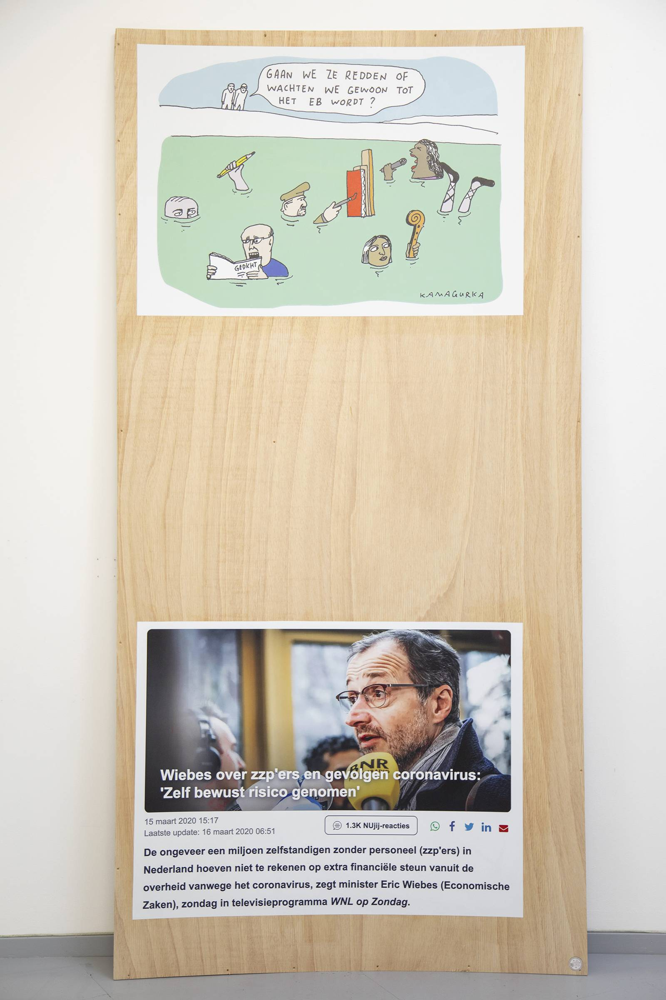

---
Pr-id: INC Theory on Demand #49
P-id: INC Theory on Demand
A-id: 49
Type: article
Book-type: anthology
Anthology item: article
Item-id: unique no.
Article-title: De bevrijding van het mecenaat
Article-status: accepted
Author: Liesbeth Bik, Helleke van den Braber, Timo Demollin, Nous Faes, Roel Griffioen, Anna van Leeuwen, Sofia Patat, Jack Segbars, Renée Steenbergen, Olav Velthuis
Author-email:   corresponding address
Author-bio:  about the author
Abstract:   short description of the article (100 words)
Keywords:   50 keywords for search and indexing
Rights: CC BY-NC 4.0
...

# Voor wat hoort wat, maar wat dan precies?

### Roel Griffioen

De grenzen tussen publiek en privaat in de kunstwereld worden hertekend.
Steeds meer verzamelaars en filantropen investeren in stenen, bouwen
privémusea of kopen podia die voorheen publiek bezit waren. Particuliere
fondsen ondersteunen publieke instellingen. Tegelijk ontstaan er nieuwe
plekken met aan de voorkant een publieke taal en werking die aan de
achterkant gekoppeld zijn aan commerciële vastgoedontwikkeling. Is hier
sprake van vastgoedmecenaat?

## Brood en spelen

Waarschijnlijk heeft u het nieuws al gehoord. Als de vergunningen rond
zijn en de verbouwing is klaar, is Amsterdam over een paar jaar een
culturele topattractie rijker. Werktitel: 'Museum of Contemporary Art',
hoewel het eerder om een kunsthal lijkt te gaan, want de instelling
bouwt geen collectie op. Er komen ook ateliers, horeca en een
auditorium. En wat het mooiste is: de beursmiljardair Rob Defares
betaalt. Dat wil zeggen, zijn filantropische vehikel Hartwig Art
Foundation. De betrokken wethouders zijn verguld en spreken van een
'cadeau voor de stad'. Het enthousiasme in de gemeente is zelfs zo groot
dat men bereid is zelf de huisvesting van de kunsthal te regelen. Op 15
september 2021 stemde de gemeenteraad in met het plan om het voormalige
justitiegebouw op de Parnassusweg aan te schaffen om het vervolgens aan
de Hartwig Art Foundation door te verhuren. Voor het gebouw betaalt
Amsterdam 26.825.000 euro aan de huidige eigenaar, de
Rijksgebouwendienst. Welkom weldoener!

Het plan van Defares heeft de discussie over privaat initiatief in de
cultuursector opnieuw doen oplaaien. Want betreft het wel een 'cadeau'
als de geschenkverpakking en bezorging met publieke middelen worden
betaald? Waarom werpt de gemeente zich op als weldoener voor de
weldoener? Wat de Amsterdamse kunsthalkwestie illustreert, is dat de
lijnen tussen publiek en privaat in de cultuursector in beweging zijn.
Er is een hele lichting Quote 500-leden die zich meer zichtbaar in het
culturele veld roert dan gebruikelijk was. Toen selfmade bankier Dirk
Scheringa in 1997 een museum opende, werd dat als een eigenzinnige gril
van een eenling gezien. Nu worden er her en der in het land privémusea
opgericht door steenrijke chemie-industriëlen, *turn-around-managers* en
supermarktondernemers.

Een tweede trend, die door Timo Demollin in kaart is gebracht voor
Platform BK: particuliere fondsen zoals Ammodo, Droom en Daad en Hartwig
Art Foundation die kunstmusea, presentatie-instellingen en
postacademische instellingen steunen. Soms in ruil voor invloed, zoals
Stichting Droom en Daad van de miljardairsfamilie Van der Vorm. Droom en
Daad is de belangrijkste private geldschieter van de lokale Rotterdamse
cultuursector via grote donaties aan instellingen, een makersloket voor
kunstenaars en eigen projecten zoals muziekbroedplaats Batavierhuis en
het FENIX Landverhuizersmuseum. De stichting kan in de persoon van
directeur Wim Pijbes direct onderhandelen met hoge gemeenteambtenaren in
een speciaal daarvoor ontworpen stuurgroep. In 2019 kwam de stichting in
opspraak omdat het twee schenkingen van elk veertig miljoen aan museum
Boijmans Van Beuningen introk. De reden: het museum weigerde twee
plekken voor de stichting in te ruimen in de raad van toezicht.

En er lijkt zich voorzichtig nog een trend af te tekenen. Over de gehele
linie lijkt in deze tijd van hoogconjunctuur op de woningmarkt en
ruimtewoeker in de steden lijkt de relatie tussen cultuur en vastgoed
inniger te worden. Het Centraal Museum in Utrecht ontwikkelt samen met
een hotelexploitant een Museumhotel, dat 84 kamers levert voor
bemiddelde 'internationale cultuurtoeristen'. In Zaandam -- inmiddels
een demografische uiterwaarde van Amsterdam -- opende in 2020 kunsthal
Het HEM, een initiatief van ondernemer-filantroop Alex Mulder die zijn
kapitaal verdiende als ondernemer in de uitzendwerksector. Zijn
beheermaatschappij Amerborgh investeert in vastgoedontwikkeling, hotels
en kunst en cultuur en het was de bedoeling dat die combinatie ook in
Zaandam toegepast zou worden met een door OMA ontworpen hotel. Een
directe veerverbinding brengt de Amsterdammers tot bij de voordeur. Ook
zijn er niet-commerciële organisaties die een publiek programma draaien
met publieke middelen, maar die wel ingebed zijn in commerciële
vastgoedontwikkeling. In 2020 beschreef ik in *Metropolis M* (Nr 1/2020)
drie voorbeelden van kunstruimtes die gecreëerd worden binnen de logica
van 'onderhandelingsplanologie', een soort handjeklap tussen de overheid
en marktpartijen. Joep van Lieshouts stichting AVL Mundo onderhandelt
met de gemeente over de bouw van 'Brutus', een cultuurcluster van
achtduizend vierkante meter gefinancierd door drie woontorens van
respectievelijk 120, 76 en 60 meter hoog. Op een veel kleinere schaal
opende Bureau Postjesweg in 2020 de deuren in de Amsterdamse buurt
Overtoomse Veld, in een door ontwikkelaar Heutink gebouwd wooncomplex.
De ruimte bestaat omdat door de stadsdeelvoorzitter in de tender was
opgenomen dat er een publieke kunstruimte in de plint van de nieuwbouw
moest komen. Een derde project dat in het artikel werd uitgelicht,
Kunsthalle Amsterdam, is niet van de grond gekomen. Niet omdat de
projectontwikkelaar Wonam dwarslag, meldt een van de initiatiefnemers
telefonisch, maar omdat de vooruitzichten door corona steeds minder
rooskleurig werden.

## Kunst als schakel in het vastgoedbedrijf

Sinds het vorige artikel zijn er nog een aantal initiatieven aan de
voorgrond gekomen waarin publiek en privaat, cultuur en vastgoed op
nieuwe manieren met elkaar in verbinding komen. Radius in Delft,
bijvoorbeeld, een 'Centrum voor Hedendaagse Kunst en Ecologie' in een
ondergronds waterbassin van een monumentaal pomphuis aan de rand van het
stadscentrum. Radius opent in april dit jaar, enkele maanden later dan
gepland. De programmering is rond, maar de verbouwing kan pas beginnen
als alle vergunningen binnen zijn en dat kost meer tijd dan verwacht.
Man bijt hond *meets* de Rijdende rechter, zo typeert Niekolaas Johannes
Lekkerkerk deze fase. Veel diplomatie, veel bureaucratie, veel
administratie, weinig kunst. 'Maar je leert wel je gebouw op deze manier
goed kennen.'

Tot begin 2020 gaf hij met Julia Geerlings leiding aan de Rotterdamse
tentoonstellingsruimte A Tale of A Tub. De mogelijkheid om nieuwe plek
te beginnen, diende zich aan toen zijn vader, de Delftse
projectontwikkelaar Robert Lekkerkerk, een watertorencomplex met
pomphuis kocht en een bestemming zocht voor het enorme waterbassin. Het
complex stond al een hele tijd te koop, vertelt Lekkerkerk junior. De
reden daarvoor is dat het perceel grenst aan een complex van DSM met een
hoge beveiligingsgraad. In een bepaalde actieradius daaromheen mag geen
nieuwbouw worden gerealiseerd. De watertoren bevindt zich binnen die
actieradius. Het complex krijgt daarom geen woonfunctie maar een
verblijfsfunctie. In de toren zelf komen kantoren en een
evenementenruimte, en in het pomphuis een restaurant en het
kunstencentrum. Radius wil zich richten op kunst in relatie tot klimaat,
natuur en ecologie en ziet klimaatproblematiek als een onderdeel van 'de
samenhangende crisis van het kapitalisme, sociale en politieke onrust,
milieurampen en technologische transformatie', aldus de website.

Maar is Radius nu een particulier initiatief of niet? 'De toedracht van
de totstandkoming is weliswaar particulier,' zegt Lekkerkerk, 'maar hoe
de organisatie in elkaar steekt en het programma dat gedraaid gaat
worden, past meer bij instellingen met een publiek mandaat.' De
renovatie wordt door de eigenaar, dus het bedrijf van de vader,
bekostigd. En Radius huurt voor een 'gunstig tarief', namelijk 60 euro
per vierkante meter. 'Dat is ongeveer wat je doorgaans voor opslag zou
betalen. Een marktconforme huur zou misschien het vijfvoudige bedragen.'
Maar voor de rest zit er volgens Lekkerkerk geen privaat geld in het
project. Het draait op publieksmiddelen en eigen inkomsten uit de
verhuur van de tentoonstellingsruimte.

Tegelijk realiseert Lekkerkerk zich dat de schappelijke huurprijs van
RADIUS samenhangt met hoe de rest van het gebouw wordt geëxploiteerd.
'Wij hebben een lage huur omdat er ook een restaurant is voorzien met
een hogere huur. Een broodje is nu eenmaal sneller verkocht dan een
toegangsbewijs. De bundeling van inkomsten zorgt ervoor dat zo\'n
renovatie gefinancierd kan worden. En dat je een bank kan overtuigen van
je plannen.'

DIEPEVEEN staat er met hoofdletters op de toren, een soort reclamezuil
die uit dit bizarre kantoorgebouw met magazijn (1929-1930) van architect
Willem Kromhout steekt. In dit markante pand in Rotterdam is een nieuwe
kunstruimte gevestigd: de Huidenclub. De naam verwijst naar een
leerlooierij die zich in het achtergelegen pand bevond. De Huidenclub
opent in februari dit jaar, maar vorig jaar was er tijdens de Rotterdam
Art Week al een voorproefje te zien. Onder de gemeenschappelijke noemer
'SELF-ASSEMBLE' waren er drie tentoonstellingen ingericht waarin werd
onderzocht, en hier parafraseer ik het persbericht, hoe 'bottom-up
non-institutions' thema's als sociale en ecologische gerechtigheid
kunnen adresseren.

De Huidenclub komt voort uit toeval, zegt Liv Vaisberg, een curator en
organisator die naam maakte met alternatieve kunstbeurzen als
Poppositions en Collectible in Brussel. Tijdens de eerste coronalockdown
in 2020 verhuisde zij met haar gezin van Antwerpen naar Rotterdam. Een
bevriende architect attendeerde haar op het grotendeels leegstaande
monumentale industriepand Diepeveen. Daar ontwikkelde
vastgoedontwikkelaar Dudok met bouwbedrijf Dura Vermeer een
mini-hoogbouwenclave met een aantal woontorens, maar voor het gebouw
zelf -- toch de blikvanger van het project -- bestond geen duidelijke
bestemming.

De architect, Tomas Dirrix, was bij het project betrokken en nodigde
Vaisberg uit eens te komen kijken. 'Misschien kan je er een beurs
organiseren', zei hij tegen Vaisberg. 'Ik kwam langs en zag meteen de
mogelijkheden. Studios, coworking en grote ruimte voor tentoonstellingen
en presentaties. De architect zei: "Oké, laten we het bij de eigenaar
pitchen."' Dudok, de eigenaar van het gebouw, hapte toe. Het bedrijf
sponsort het project met een startinvestering voor de verbouwing.
Bovendien hoeft de Huidenclub voor de tentoonstellingsruimte geen huur
te betalen. Voor de andere ruimtes, kantoren, werkplaatsen en mogelijk
horeca, betaalt de Huidenclub wel huur, die het -- *Corona volente* --
hoopt te halen uit de verhuur van coworking-plekken en horeca-inkomsten.
Waarschijnlijk is de Huidenclub geen lang leven beschoren -- tenminste,
niet op deze locatie. Dat is deel van de afspraak, zegt Vaisberg. 'Eerst
mochten we vijf jaar blijven, nu wordt er drie jaar gezegd. Wat daarna
komt is niet duidelijk, misschien een hotel of restaurant.'

Diepeveen is gelegen op een gentrificatiebreuklijn waar tegelijk
zichtbaar sprake is van investering en deinvestering. Er stroomt nieuw
geld binnen. Er wordt veel gebouwd in de omgeving, vooral in de
voormalige havens van het Merwe-Vierhavengebied die vertimmerd worden
tot een nieuw stuk woonstad met een groot aandeel woningen in het
zogenaamde 'bovensegment', afgewisseld met ruimtes voor de
"maakeconomie" en creatief ondernemerschap. De studio van Daan
Roosegaarde bevindt zich hier en om de hoek hoopt Joep van Lieshout met
zijn Brutus-plan een graantje mee te pikken van de aanstaande
metamorfose van de omgeving.

Het contrast is groot met de andere kant van Diepeveen, waar het aan de
tweelingbuurt Bospolder/Tussendijken grenst. Beide buurten, Bospolder en
Tussendijken, behoren tot de armste postcodegebieden van Nederland. De
werkloosheid, schooluitval en laaggeletterdheid liggen er bijna twee
keer zo hoog dan de Rotterdamse gemiddelden. En de terugtrekkende
overheid laat er sporen na. Vorig jaar nog moest het Zelfregiehuis, een
sociaal centrum dat voortkwam uit een eerder wegbezuinigd buurthuis,
zelf via Funda vernemen dat de gemeente hun gebouw te koop had
aangeboden.

'Ze willen hier een soort Amsterdam Noord maken,' zegt schrijver en
kunstcriticus Florian Cramer, die zelf al 15 jaar in Bospolder woont, op
een minuut lopen van Diepeveen. Hij doelt dan met name op het
Merwe-Vierhavengebied, maar de ontwikkelingen daar galmen na in
Bospolder-Tussendijken. Begin vorig jaar kregen Cramer en veel
straatgenoten te horen dat hun huurwoningen -- 'klassieke
huisjesmelkersappartementen' -- waren doorverkocht aan een
internationale beleggingsmaatschappij, Tristan Capital. Die koopt de
woningen met het vooruitzicht van een *rent gap*, om een begrip uit de
gentrificatietheorie te gebruiken: de kennis dat toekomstige huren vele
malen hoger liggen dan de huidige huren. Zes maanden lang hadden Cramer
en zijn buren geen bankrekeningnummer om de huur over te maken, tot ze
een advocaat op de zaak hebben gezet. 'Dat blijkt een bekende truc om te
zorgen dat bewoners een huurachterstand opbouwen. Na een jaar komt er
dan een dikke rekening die veel mensen niet kunnen betalen.' Zo heeft de
eigenaar een grond om door henzelf gecreëerde 'wanbetalers' uit hun huis
te zetten en de woning vervolgens 'marktconform' weer terug in de
verhuur te brengen. Dat is de ontwrichtende realiteit van gentrificatie
en de financialisering van het wonen anno 2022.

Dudok en Dura Vermeer zijn niet verantwoordelijk voor het handelen van
Tristan Capital en andere beleggingsmaatschappijen in
Bospolder/Tussendijken. Maar al deze partijen profiteren van het feit
dat stedelijke ontwikkeling steeds meer wordt overgelaten aan
marktpartijen. En die marktpartijen zijn geen individuele woningkopers
of lokale pandjesbazen, maar nationaal opererende projectontwikkelaars
en internationaal actieve vastgoedbedrijven en beleggingsfondsen. Dudok
en Dura Vermeer zijn belangrijke stakeholders in dit stuk stad die veel
geld verdienen aan de transformatie ervan. Zo bezit en ontwikkelt Dudok
ook het markante HAKA-gebouw op een steenworp afstand van Diepeveen. Het
Dakpark, waarvan Diepeveen het geografische sluitstuk is, werd dan weer
ontwikkeld door Dura Vermeer met de Gemeente Rotterdam.

Cramer ziet in de Huidenclub een verlengstuk van Dudok en Dura Vermeer
en wijst daarvoor op de websites van de twee bedrijven. Daarop wordt de
suggestie gewekt dat de door de Huidenclub geleverde creativiteit
symbool staat voor het hele vastgoedproject. 'Stel je voor. Een plek
waar creatie centraal staat,' klinkt het in een gelikt promofilmpje
terwijl er prikkelende beelden voorbijschieten van een breakdancer tegen
de achtergrond van de Euromast en van een kunstenaar aan het werk in een
ruime, goed verlichte en verdacht schone atelierruimte. Op de website
van de Huidenclub treft hij dan weer de vormgeving en retoriek aan die
hij herkent van plekken als Melly, BAK en Casco. Dat wringt. 'Aan een
*white cube* of commerciële galerie zou ik minder aanstoot nemen. Maar
ik vind het stuitend dat hier het vocabulaire, de taal van een
activistische, zelfgeorganiseerde kunstinitiatieven wordt gebruikt voor
een vastgoedproject. Wees eerlijk over wat je bent.' Na ons gesprek
e-mailt Cramer een scan van een flyer die enkele maanden geleden bij hem
door de brievenbus viel. Een uitnodiging van een informatieavond van
Dudok, Dura Vermeer en de Gemeente Rotterdam, georganiseerd in de
Huidenclub. 'Dus een perfecte *public/private* belangenverstrengeling,
met kunst als het vloeimiddel\...'

Vaisberg vindt het belangrijk om te benadrukken dat het idee voor de
Huidenclub bij haar en Chantal Schoenmakers vandaan kwam, niet bij Dudok
of Dura Vermeer. De Huidenclub is geen instrument van de eigenaren,
onderstreept ze aantal keer in ons gesprek. 'Ik heb eigenlijk maar een
paar keer contact met ze gehad. Met de programmatie bemoeien zij zich
überhaupt niet. Wij hebben *carte blanche*.' Maar ze snapt waar de
suggestie van *art washing* vandaan komt. 'We kwamen in een brochure
terecht van Dudok en we moesten daarna zelf ontdekken dat we prominent
op hun website en die van Dura Vermeer te staan.' Vaisberg baalt ervan.
'Ik vind het jammer, maar we hebben er geen controle over. Het lijkt
alsof we onderdeel zijn van het vastgoedplan, terwijl voor mij
onafhankelijkheid juist heel belangrijk is.' Tegelijk benadrukt Vaisberg
dat je in de kunstwereld niet je handen in onschuld moet wassen: 'Geld
komt altijd ergens vandaan. Ik kom uit de wereld van beurzen, daar is
ook veel vies geld van verzamelaars die dure kunst kopen. Daar moet je
niet hypocriet over doen. Maar ik hoop dat mensen als ze hier komen wel
vertrouwen in wat ze zien en wat we doen.'

Plekken als Radius en de Huidenclub komen voort uit de omstandigheden.
Niet lang geleden was het vanzelfsprekend dat kleine en middelgrote
instellingen huisvesting zochten in het publieke domein. Ze konden een
gebouw of huren van de gemeente of woningcorporatie of voor een zacht
prijsje overnemen. Een eerdere generatie instellingen kwam voort uit de
kraakbeweging, zoals productie- en presentatieplekken Extrapool in
Nijmegen, W139 en OT301 in Amsterdam, Quartair in Den Haag, V2\_ in
Rotterdam.

Nu lijken alle aanvoerroutes die er bestonden voor kunstenaars en
curatoren om een ruimte te beginnen, afgesloten. Hoewel er nog steeds
gekraakt wordt, is de sterke ruimte-katalyserende kracht die de beweging
had door het kraakverbod van 2010 succesvol uitgedoofd. En voor
gemeenten is de verleiding te groot om in deze hoogconjunctuur te cashen
met de leegstaande gebouwen die ze hebben. In Rotterdam is het staand
beleid om vastgoed snel te verkopen tegen en tegen een zo hoog mogelijke
prijs. De stad verdiende tweehonderdmiljoen in zes jaar met de verkoop
van schoolgebouwen, buurthuizen en ander vastgoed aan investeerders,
laat een onderzoeksdossier van *Vers Beton* zien. Maatschappelijke en
culturele partijen worden buitenspel gezet: die kunnen niet opbieden
tegen ontwikkelaars en beleggingsfondsen. Je kan het je voorstellen dat
er in deze tijd van ruimteschaarste en woekerhuren een bepaalde mate van
opportunisme nodig is om een nieuwe plek te beginnen.

Bovendien tonen overheden en publieke partijen zich ook niet meer altijd
een stabiele huisbaas, zegt Lekkerkerk. 'Denk maar aan De Appel, dat al
tijden op zoek is naar een blijvende locatie. Het helpt als je een goede
verstandhouding hebt met je pandeigenaar. Dat geeft je organisatie een
steviger handvest en maakt je minder afhankelijk van injecties.' Of die
huisbaas de markt is of de staat, maakt dan niet zoveel uit.

'Leuk dat het zoontje van de kapitalist in de kelder zijn linkse hobby's
mag botvieren.' Dat was ongeveer de teneur van een aantal artikelen die
over Radius verschenen. Lekkerkerk: 'Die hyperbolen in de pers ben ik
een beetje zat. Ik zie het absoluut als een voorrecht dat ik dit mag
doen, maar ik ben er ook al een jaar onbetaald voltijds mee bezig.' Maar
zegt het ergens ook iets over deze tijd, dat je over een sterk netwerk
moet beschikken om een plek te kunnen beginnen? 'Ja, je zou het kunnen
spinnen als een discussie over privilege. Zorgt een sterk netwerk ervoor
dat je betere toegang hebt tot "het systeem"? Tot het vinden van een
plek die anders niet beschikbaar zou zijn? Of die voor iemand anders
niet beschikbaar is? Misschien is dat wel zo. Dat zou een treurige
conclusie zijn. Maar ook een conclusie die tot een
verantwoordelijkheidsbesef moet leiden. Dat je er iets van moet maken.'

## Naar een ethiek voor publiek en privaat in een veranderde cultuursector

In ieder geval lijkt wel duidelijk dat de ontwikkeling van
vastgoedmecenaat wijst op een gedaanteverwisseling van de overheid zelf,
die verandert van een bouwer in een 'broker' -- of in beter Nederlands,
een bemiddelaar. Joep van Lieshout gaf een mooi inkijkje in dat proces,
toen ik hem in 2019 interviewde over de plannen voor Brutus. Hij heeft,
deels zelf en deels met de stichting AVL Mundo, sinds 2008 een aantal
belendende loodsen en andere voormalig industriële panden in de
Rotterdamse haven aangekocht. 'In totaal zevenduizend vierkante meter
gebouw op elfduizend vierkante meter grond', denkt hij. Daar hoopt hij
in de nabije toekomst drie uit de kluiten gewassen woontorens te
realiseren bovenop een al even enorm 'cultuurcluster'. De hoogste toren
wordt 120 meter hoog, is de bedoeling. Het cultuurcluster is het
belangrijkste, benadrukte Van Lieshout. 'En hoe wordt het dan betaald?
Nou, met deze vrienden.' Van Lieshout wees naar de drie losse torens op
de maquette van Brutus. 'Omdat wij hier een cultuurcluster bouwen, zijn
er meer mogelijkheden om de hoogte in te gaan. Als je alleen maar die
drie torens zou neerzetten, zou de gemeente zeggen: waarom? Maar als je
zegt: we gaan dat doen, zodát we cultuur, groen, iets dat de stad
verrijkt kunnen bewerkstelligen -- dan is dat voor de gemeente
interessanter. Het helpt als je wat teruggeeft.' Bureau Postjesweg, dat
in hetzelfde stuk als Brutus ter sprake kwam, kan ook bestaan bij gratie
van de bemiddeling van een lokale overheid. De projectruimte vond
onderdak in New West, een door projectontwikkelaar Heutink gerealiseerd
gebouw in het Amsterdamse Overtoomse Veld. Dat er in de
projectontwikkeling ruimte werd gereserveerd voor een publieke
kunstruimte, komt omdat het stadsdeel in 2014 in de tender liet opnemen
dat het gebouw 'een impuls' moest geven aan cohesie en 'sociale
duurzaamheid' in de buurt.

In het stedelijk beleid sluimert nog een verdunde versie door van het
sociaaldemocratische idee dat cultuur een vitale verheffende functie
heeft en thuishoort in stedelijke ontwikkeling. Maar de stad heeft niet
meer de middelen, het planningsapparaat en misschien ook niet meer de
wil om wanneer het haar behaagt ergens een museum of cultureel centrum
*ex nihilo* uit de grond te stampen. Zo is de creatie van ruimtes voor
cultuur steeds vaker afhankelijk van clausules in tenders en wisselgeld
in de onderhandelingen tussen overheden en marktpartijen, die op hun
beurt weten dat de zaken een stuk vlotter gaan wanneer een plan een
maatschappelijke of culturele meerwaarde heeft. *Social return* *of
investment*, heet dat in goede Nederlandse beleidstaal. Het gevaar is
natuurlijk ook zichtbaar: dat publieke voorzieningen zoals kunstruimtes
smeermiddel worden in verder cynische vastgoeddeals. Critici van deze
ontwikkeling -- en ik hoor daar zelf ook bij -- spreken wel van de
opkomst van 'afwijkingsplanologie', of erger, ondoorzichtige
'skyboxplanologie', waarbij de stedelijke vormgeving het gevolg is van
onderonsjes tussen markt en staat. Extra saillant is het als deze nieuwe
plekken voor de kunst gesitueerd zijn in wijken waar een grotere
transitie van publiek bezit naar privaat bezit plaatsvindt, omdat
sociale woningbouw er per strekkende kilometer op de markt wordt gezet.
Dat geldt voor Bospolder/Tussendijken in Rotterdam, maar net zo goed
voor Overtoomse Veld in Amsterdam.

Ook instellingen die ontstaan binnen de logica van vastgoedmecenaat
kunnen waardevolle toevoegingen zijn aan een steeds verder eroderend
kunstenlandschap. Maar zonder te willen vervallen in cynisme en elk
particulier initiatief te brandmerken als 'fout', denk ik dat deze
ontwikkeling kritisch gevolgd moet worden. Het probleem is niet zozeer
dat private partijen zich steeds duidelijker manifesteren in de kunsten.
Het probleem is dat we er niet goed in slagen om een 'ethiek' te
mobiliseren om deze ontwikkeling te lezen, toetsen en sturen. Dat komt
omdat het vanaf de zijlijn niet altijd meer duidelijk is hoe de grens
tussen publiek en privaat nu precies loopt, en of er überhaupt nog wel
sprake is van een grens. Er zijn publieke instellingen die met
toewijding de voortschrijdende privatisering smeren, en private spelers
die broodnodige nieuwe ruimtes voor publiek debat creëren. Publieke
partijen worden succesvoller in het aanwerven van privaat geld, maar
andersom zijn private projecten ook op talloze manieren verbonden met
publieke geldstromen en agenda's.

Soms is de situatie zo complex dat verstrengeling en verwijdering tussen
publiek en privaat op magische wijze samenvallen. Een bekend Rotterdams
museum ligt publiekelijk in de clinch met een filantropische
miljardairsfamilie omdat het geen plekken in de raad van toezicht wil
afstaan in ruil tegen twee schenkingen van elk veertig miljoen. Schande!
Tegelijk werkt hetzelfde museum innig samen met dezelfde
miljardairsfamilie aan een semipubliek spiegelpaleis, de publiek-private
natte droom par excellence. Snapt u het nog?

Geschenken hebben iets magisch, zowel om te geven als om te ontvangen.
Dus wat dat betreft is het geweldig dat overheden en marktpartijen
tegenwoordig grossieren in wederzijdse presentjes. Maar laten we niet
naïef zijn. De antropoloog Marcel Mauss schreef over geschenken dat ze
vrijblijvend ogen maar vaak niet zijn.[^06_1] Een geschenk kan een claim op
de ontvanger leggen, omdat er de impliciete verplichting van een
wederdienst is. Het principe 'voor-wat-hoort-wat' bestaat ook in de
nieuwe geefcultuur. Maar het 'hoort-wat' blijft vaak buiten zicht, omdat
we niet gewend zijn om van private partijen die zich in het publieke
veld manifesteren *public accountability* te eisen. In een nieuwe ethiek
om vat te krijgen op het veranderende heden, is dat een minimale eis.
Bij publiek handelen hoort publieke verantwoordelijkheid, om te
voorkomen dat private belangen de publieke zaak kunnen beschadigen.

*Het eerste deel van dit essay verscheen oorspronkelijk in* Metropolis M
*onder de titel 'Brood en spelen: Kunst als schakel in het
vastgoedbedrijf'*, Metropolis M *(2022) 1, pp. 81-86. De laatste
paragrafen komen uit een gesproken column van de auteur, voorgedragen
tijdens het symposium* De Staat van Mecenaat. *Enkele alinea's zijn
genomen uit een ouder artikel:* *\'De kunstruimte als
vastgoedinvestering: Waarom projectontwikkelaars zich op culturele
nieuwbouw storten\',* Metropolis M *(2020) 1, pp. 32-34.*

[^06_1]: Marcel Mauss, 'Essai sur le don', *Sociologie et Anthropologie,*
    1950.
