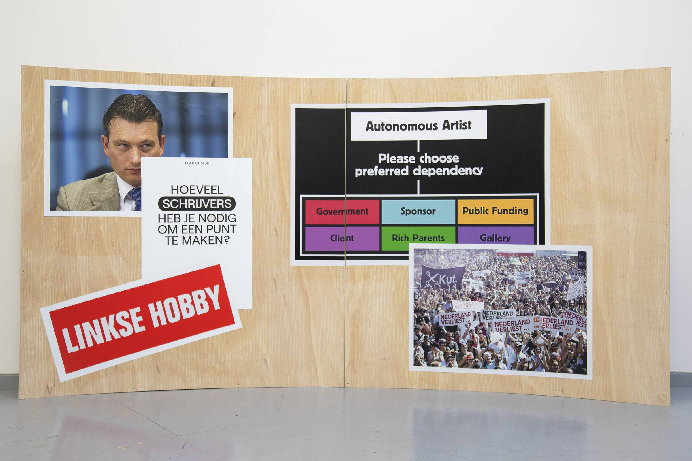

---
Pr-id: INC Theory on Demand #49
P-id: INC Theory on Demand
A-id: 49
Type: article
Book-type: anthology
Anthology item: article
Item-id: unique no.
Article-title: De bevrijding van het mecenaat
Article-status: accepted
Author: Liesbeth Bik, Helleke van den Braber, Timo Demollin, Nous Faes, Roel Griffioen, Anna van Leeuwen, Sofia Patat, Jack Segbars, Renée Steenbergen, Olav Velthuis
Author-email:   corresponding address
Author-bio:  about the author
Abstract:   short description of the article (100 words)
Keywords:   50 keywords for search and indexing
Rights: CC BY-NC 4.0
...

# Willen we een staat van mecenaat?

### Liesbeth Bik

Mecenaat: zelf als kunstenaar hebben we er misschien niet direct mee te
maken maar we observeren wel, van dichtbij, een aantal ontwikkelingen.
Ik noem er een aantal ter illustratie, min of meer uitgebreid. Veel van
de onderstaande informatie is te vinden op de websites van deze
instituten en musea.

## Het SFMOMA

De Doris en Donald Fisher Collectie behoort tot de grootste
privécollecties van hedendaagse kunst ter wereld. Als oprichters van het
in San Francisco gevestigde Gap begon het echtpaar halverwege de jaren
zeventig met verzamelen. De relatie van de Fishers met het San Francisco
Museum of Modern Art (SFMOMA) bestaat sinds de jaren tachtig van de
vorige eeuw, toen ze lid werden van de raad van toezicht van het museum.
Ze schonken aan het museum, en hebben talrijke tentoonstellingen,
aankopen en educatieve programma's gesteund. Ze wilden eigenlijk een
museum bouwen maar konden geen locatie vinden, dus wendden zij zich tot
SFMOMA om dat museum uit te breiden. SFMOMA bouwde dus een gebouw
(kosten 305 miljoen dollar) voor een particuliere collectie gebaseerd op
de gedeelde passie van één echtpaar, waarmee die collectie vitaal
onderdeel is geworden van het culturele weefsel van San Francisco.
Daarbij strekt de invloed van de familie op het SFMOMA zich nu uit tot
ver in de toekomst door middel van een partnerschap om de
Fisher-collectie altijd in het grootste deel van het museum te
presenteren.

Afspraken die zij met het museum maakten zijn onder meer:

-   Een groepering van werken uit de Fisher-collectie moet hangen en
    wisselt eens in de tien jaar.

-   Een trust heeft gedurende ten minste 25 jaar toezicht op de
    verzorging van de collectie. Onlangs is de overeenkomst uitgebreid
    tot een periode van honderd jaar, met de mogelijkheid tot
    verlenging. De bruikleentermijn eindigt in 2116.

-   Het grootste deel van de kunst in het museum is van de Fishers,
    privé. Het partnerschap van het museum is, vanwege
    belastingvoordelen, met de Fisher Art Foundation.

-   Fisher en haar drie zonen zijn de enige beheerders van de stichting.
    Zoon Bob is voorzitter van de raad van bestuur van het SFMOMA.

-   In de zalen van de Fisher Collectie mag niet meer dan 25 procent van
    de tentoongestelde stukken afkomstig zijn van andere bruikleengevers
    of donoren.

 SFMOMA, maar dat is niet zo. Over meer dan drie verdiepingen van het
zeven verdiepingen tellende museum is de Fischer collectie permanent
tentoongesteld. De tweede en zevende verdieping zijn gereserveerd voor
wisselende tentoonstellingen gecureerd door curatoren van het museum, of
gast-curatoren.

Toegang tot de tentoonstellingen is 25 USD voor volwassenen, 22 USD voor
senioren en 18 USD voor jongeren. Jongeren en kinderen van 18 jaar en
jonger hebben gratis toegang.

## Wildgroei van privécollecties in Parijs

Er is, wereldwijd, een enorme groei van privécollecties, die vaak in
nauwe samenwerking met lokale overheden openbare gebouwen (publiek
bezit) verbouwen en in gebruik nemen voor hun particuliere musea. In
Parijs is er een ware hausse aan dergelijke particuliere initiatieven.
Een greep.

Dit voorjaar was er tegelijkertijd een tentoonstelling van Charles Ray
in Centre Pompidou (een publieke instelling) en in de Parijse vestiging
van de Pinault Collection, die ook de sponsor is van Pompidou. De
Pinault Collection is gevestigd in de Bourse de Commerce in Parijs en in
het Palazzo Grazzi in Venetie. 'Het delen met het publiek van de vragen
die de kunst oproept en ons stelt, dat is de eigenlijke zin van het
culturele project dat ik heb opgestart,' in de woorden van de
invloedrijke verzamelaar François Pinault op de website van de Pinault
Collection. Fondation Pinault beheert zijn private kunstverzameling.
Pinault is eigenaar van de Fnac-keten, Gucci, Yves Saint Laurent,
Samsonite en het het veilinghuis Christie's. Pinault wil niets minder
dan het hele ecosysteem van Parijs dynamischer maken. Toegang tot al
deze instituten is niet gratis.

Lafayette Anticipations in Parijs steunt hedendaagse kunst, via  twee
instellingen van 'algemeen belang', de Fondation d'entreprise Galeries
Lafayette en het Fonds van de belanghebbende Famille Moulin, die voor
een groot deel eigenaar is van het warenhuis Galeries Lafayette, en van
Carrefour. Lafayette Anticipations wil een katalysator zijn door
kunstenaars op maat gemaakte omstandigheden te bieden om te produceren,
te experimenteren en tentoon te stellen. Toegang tot de
tentoonstellingen is gratis.

Louis Vuiton Foundation, met de kunstverzameling van zakenmagnaat,
investeerder, en kunstverzamelaar Bernard Arnault, heeft als missie om
het publiek te dienen, en wil kunst en cultuur voor iedereen
toegankelijk te maken en nationaal en internationaal promoten, door het
organiseren van tijdelijke tentoonstellingen, collectiepresentaties,
events, en opdrachten aan kunstenaars voor werk op locatie. Toegang is
niet gratis.

De Fondation Cartier, opgezet door Alain Dominique Perrin, een
emblematisch figuur in de luxe goederen wereld, zet zich in voor de
bevordering en de bewustmaking van het publiek op het gebied van de
hedendaagse kunst door middel van tentoonstellingen, en opdrachten aan
kunstenaars, waardoor hun belangrijke collectie direct wordt verrijkt.
De tentoonstellingen en de collectie zelf worden vaak naar buitenlandse
instellingen gestuurd, waardoor de internationale uitstraling van de
Fondation Cartier wordt versterkt. Toegang is niet gratis.

Pernod Ricard Foundation, opgezet door de op één na grootste
distilleerder ter wereld, profileert zich met een zoals ze het zelf
noemen 'baanbrekend en gedurfd' programma van tentoonstellingen en biedt
een platform aan performance en debatten over maatschappelijke thema's.
Pernod Ricard Foundation steunt de jonge Franse kunstscène om zich op
internationale schaal te ontplooien, en biedt ter ter plaatse zowel
logistieke als financiële steun. Toegang is gratis.

## Valkuilen, voetnagels en klemmen

Deze voorbeelden geven een inzicht in de problemen die kunnen optreden:

-   Relatie gevers-ontvangers niet helder.

-   Belangen niet expliciet, waardoor belangenverstrengeling,
    rolverwarring, wederdiensten, zelfcensuur, reëel wordt.

-   Troebel waar het geld dat wordt ingezet in kunstinstellingen, mee
    verdiend wordt.

-   Onbalans privé en publiek onder het mom van publiek belang.

-   Waarden die we als samenleving willen kunnen onder druk komen te
    staan. Privé gevers kiezen zelf waar ze geld aan geven. In
    tegenstelling tot een samenleving die beslist.

Wat staat er op het spel? Niets minder dan het eigenaarschap over de
democratie. De overheid, gemandateerd het publieke belang te
vertegenwoordigen en gekozen via verkiezingen, leunt achterover als ze
taken overlaat of delegeert aan prive partijen. Deze partijen krijgen
daardoor grote invloed in het publieke domein, op het publieke debat en
democratische waarden. Met inzet van kunst nemen zij het publieke domein
over, en krijgen en nemen steeds meer ruimte agenda stellend te zijn,
terwijl de overheid het mandaat heeft onze democratische ruimte te
bewaken. Vertrouwen in de overheid wordt zo stelselmatig door diezelfde
overheid ondermijnd. Democratische processen laten achteroverleunen niet
toe: het vereist oplettendheid, werk en onderhoud, van ons allemaal.

Is generositeit zonder eigen belang? Is het emancipatoir voor alle
groepen in de samenleving? Welke stemmen krijgen een platform? Als de
samenleving een brede opvatting over cultuur, wil, inclusief, divers,
omdat dat recht doet aan de bevolkingssamenstelling: hoe garanderen we
dat dan als samenleving? Welke afspraken maken we dan?

Publieke kunstinstellingen krijgen steeds meer taken. Codes
(gedragsregels) moeten een grotere publieke toegankelijkheid garanderen
en zijn ook leidend bij subsidieaanvragen. Maar: de blik openen naar de
voorheen veronachtzaamde 25% moet ook in geld uitgedrukt worden. Simpel
gezegd: 25% meer publieksbereik is ook 25% meer werk. Codes zijn een
nobel streven maar werken niet per se gelijkheid in de hand, en er is
weinig onderzoek naar hoe mecenaat ongelijkheid in stand houdt. Wie valt
buiten beschouwing?

## Willen we een staat van het mecenaat? Wat wil een samenleving op lange termijn?

Wie betaalt bepaalt. Als we, ter illustratie van wat op het spel staat
en bij wijze van een voorbeeld uit een andere publieke sector, het
onderwijs, alleen privé onderwijs zouden hebben dat volledig haar eigen
curriculum zou mogen bepalen, ondermijnt dit de publiek gedeelde waarden
en dus de samenleving, uiteindelijk. Dat is dus niet in het publieke
belang. Stelselmatig stelt de samenleving, wij dus, vast, wat we
belangrijk vinden en waarom, waar je minimaal op kunt rekenen, en wat
daarvoor nodig is. Deze vaststelling komt tot stand in een proces van
deliberatie: een democratisch proces van beraadslaging en overleg waar
afstemming via het uitwisselen van informatie en standpunten
plaatsvindt.

Kunst verandert de samenleving niet. Mensen doen dat. Maar kunst toont
wel andere perspectieven, waardoor opvattingen en ideeën veranderen.
Meerdere perspectieven dus. Meer opties, meer mogelijkheden, meer
transparantie. We kunnen dit niet alleen aan privé partijen overlaten,
die op grond van eigen particuliere keuzes of belangen het publieke
domein, onze samen-leving, vormgeven.

Een gezond ecosysteem is *en...en...en...,* met checks en balances.

*Dit artikel werd oorspronkelijk gepubliceerd door Platform Beeldende
Kunst op 8 juli 2022.*
