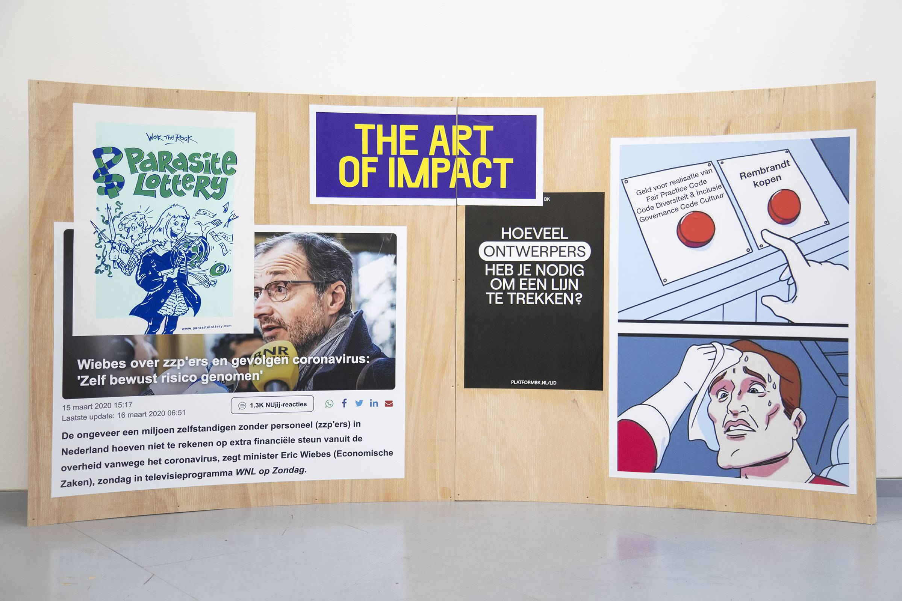

---
Pr-id: INC Theory on Demand #49
P-id: INC Theory on Demand
A-id: 49
Type: article
Book-type: anthology
Anthology item: article
Item-id: unique no.
Article-title: De bevrijding van het mecenaat
Article-status: accepted
Author: Liesbeth Bik, Helleke van den Braber, Timo Demollin, Nous Faes, Roel Griffioen, Anna van Leeuwen, Sofia Patat, Jack Segbars, Renée Steenbergen, Olav Velthuis
Author-email:   corresponding address
Author-bio:  about the author
Abstract:   short description of the article (100 words)
Keywords:   50 keywords for search and indexing
Rights: CC BY-NC 4.0
...

# De grote verdwijntruc: Verwarring en rekenschap in de publiek-private knoop

### Jack Segbars

Er heerst een groot, aanhoudend misverstand omtrent de positie van
beeldende kunst in de maatschappij en de belangen, het eigenaarschap, en
de verantwoordelijkheden die uit deze positive voortvloeien. Zoveel werd
duidelijk tijdens het symposium *De staat van mecenaat,* georganiseerd
door Platform BK, Framer Framed en Timo Demollin. In het symposium
traden kunstenaars, onderzoekers, particuliere en institutionele
schenkers, fondsenwervers en vertegenwoordigers van musea en
presentatie-instellingen met elkaar in gesprek. Zo werd er
steekproefsgewijs een overzicht werd gegeven op de infrastructuur van
belanghebbenden in het kunstenveld.

Wie zorgt er voor de kunst in de vierhoek: mecenas, politiek, kapitaal
en burger? Menig spreker deed herhaald beroep op de brede
verantwoordelijkheid van de overheid voor het financieren van de
infrastructuur voor de kunst (net zoals voor gezondheidszorg, onderwijs
en sociale zekerheid). Waar deze verantwoordelijkheid de afgelopen
decennia aan erosie ten onder lijkt te gaan, werd gaandeweg duidelijk
dat deze voor de kunst eigenlijk zelden bestaan heeft als politieke
idee: de idee van private partijen die vanuit eigenbelang verwachtingen
stellen bij het publieke stelsel en er invloed op uit kunnen oefenen, is
altijd al de expressie en praktijk van de (neo)liberale ideologie
geweest. Ook blijken er hardnekkige misverstanden te heersen over wat
kunst behelst: is het product of praktijk? In deze tekst worden enkele
infrastructurele verhoudingen doorgelicht aan de hand van een greep uit
de inbreng tijdens het symposium.

## Mecenaat in het neoliberale project

Nous Faes sprak tijdens haar panel over de 'korte twintigste eeuw'
waarmee zij doelde op de korte periode, grofweg tot aan de jaren
zeventig, waarin er sprake was van een ideologisch geleide
welvaartstaatspolitiek, waarbij de staat de primaire
verantwoordelijkheid droeg voor de kunsten en kunstenaars, en hun
bestaan door de gemeenschap werd gedragen en gewaardeerd. Het idee is
daarbij dat de overheid zorgt voor de structurele onderbouw van
voorzieningen, waaronder gebouwen en financiële steun voor kunstenaars)
Dit impliceerde een beperkte en *ondersteunende rol* voor mecenaat --
giften in geld en schenking van goederen, zonder directe tegenprestatie
-- bijvoorbeeld in de financiering van aanvullende projecten. In deze
rolverdeling blijft de overheid de regie voeren.

Onder druk van de neoliberale bestuursrationaliteit is deze rolverdeling
in de afgelopen dertig jaar langzamerhand uitgehold: middels
liberalisering en onder de noemers zelfredzaamheid en eigen
verantwoordelijkheid vervreemde de relatie burger-overheid (de
'participatiesamenleving') en zijn veel taken van de overheid
bedrijfsmatig uitbesteed. Kunstinstellingen en kunstenaars werden onder
die andere noemer, het ondernemerschap*,* verwezen naar het eigen
initiatief en een concurrerende houding ten opzichte van fondsenwerving.
Nu de vraag naar cofinanciering van overheidsfondsen en particulier geld
een norm lijkt te zijn geworden in de sector worden vrijwel alle spelers
in een bureaucratische en competitieve fuik geduwd. Het systemische
probleem dat hieruit voortvloeit is dat waar mecenaat door de overheid
als vangnet ten tonele werd gebracht, het in de praktijk van weinig hulp
is geweest voor de kunst. Kan alle energie die de concurrentie om de
kruimels vergt, niet productiever worden besteed?[^09_1]

Roel Griffioen liet in zijn gesproken column horen waar de toegenomen
invloed van mecenaat zoal tot heeft geleid. Er zijn de laatste jaren
meer privé musea en kunstfondsen gestart door particuliere ondernemers
(o.a. Scheringa Museum, Museum Voorlinden, Stichting Droom&Daad, de
Hartwig Art Foundation) die niet alleen projecten financieren, maar met
eigen stenen ook een structurele positie innemen. De invloed van
kapitaalkrachtige actoren binnen het privaat-publieke neemt daarmee toe.
De mecenas is hierbij geen belangeloze weldoener die de infrastructurele
en politiek-ideëel besloten rol van de overheid overneemt. Mecenassen
genieten door hun activiteiten en giften belastingvoordelen, en kunnen
op voor hun welgevallige doelen aansturen, en met giften de publieke
ruimte en discussie naar eigen wensen ontwikkelen.[^09_2] De centrale vraag
van Griffioens column luidde: 'Voor wat hoort wat, maar wat dan
precies?' Deze bleek lastig te beantwoorden, omdat, zoals Griffioen
stelt, een ethiek van mecenaat tot op heden ontbreekt.

## De overheid verliest de regie

In haar inleidende voordracht, gebaseerd op haar stuk geschreven voor
Platform BK, verwees Renée Steenbergen naar diezelfde verwarring over de
rolverdeling.[^09_3] Zij beargumenteert dat er een verschuiving heeft
plaatsgevonden waarbij de overheid van regievoerder tot ondersteuner is
verworden: van infrastructurele beheerder tot *projectmanager*, tekenend
voor een algehele politieke tendens en teloorgang van het vermogen
sturende politieke uit te oefenen. Opvallend hierbij is dat met de rond
2015 ingezette decentralisatie van overheidstaken, waarbij
verantwoordelijkheden van de Rijksoverheid werden overgeheveld naar
gemeenten, juist een zorgplicht voor *kunst* niet werd meegegeven aan de
gemeenten, zoals dat voor zorg en onderwijshuisvesting wel gold. Dit
suggereert dat kunst niet als sociale voorziening wordt herkend. Volgens
Steenbergen is het een tendens waarbij de overheid haar
*oorspronkelijke* taak vergeet, en te veel vertrouwen stelt in
particulier initiatief en de idee van een privaat ondernemerschap.

Deze observatie werd passend geïllustreerd door het recente voorbeeld
van de miljardair en mecenas Rob Defares, dat door Griffioen werd
ingebracht: het stadsbestuur van Amsterdam koopt op verzoek van de
mecenas het voormalige rechtbankgebouw aan de Parnassusweg van het
Rijksvastgoedbedrijf om er een nieuw particulier Museum of Contemporary
Art (MCA) te kunnen huisvesten, gefinancierd door Defares. Hier wordt
middels gemeenschapsgelden de mecenas geaccommodeerd, die er naar eigen
inzicht een museum mag runnen.[^09_4] De welwillende overheid beloont hier
het particulier initiatief met haar bemiddelend en ondersteunend
vermogen, maar laat het vervolgens na verder een coherente en
samenhangende regie te nemen. Dat zou de burger wel mogen verwachten,
het gaat hier tenslotte om de inrichting van de culturele
infrastructuur, en dus om het beheer en de opbouw van de culturele canon
die besloten ligt in de kunstinstellingen die de verzamelingen en
archieven van culturele productie aanleggen. Het auteurschap van het
culturele aanbod wordt zo moedwillig overgedragen aan een vermogende
elite. Mecenaat moet niet gezien worden als eeuwenoud, geïsoleerd en
marginaal verschijnsel, maar als een van de verknoopte strengen in het
complex van productie.

## Grote gevers bepalen de canon

De ijzeren greep die de vermogenden van het grootkapitaal hebben op de
culturele productie werd haarfijn uit de doeken gedaan door Liesbeth
Bik. In haar bijdrage voerde ze ons langs oude en hedendaagse
voorbeelden van musea gesticht door mecenassen en fondsen die culturele
productie ondersteunen, maar die dat louter doen door ofwel zelf te
organiseren hoe de eigen kunstcollectie wordt tentoongesteld en
ontsloten, of door directe commerciële voorwaardes te stellen bij hoe
deze gepresenteerd worden bij reeds bestaande instellingen.

Zo heeft de privécollectie van het echtpaar Fisher geleid tot een nieuwe
vleugel van het San Francisco Museum of Modern Art, een collectie die
uitsluitend intact onder regie van het paar wordt tentoongesteld, en
regelingen heeft afgedwongen dat deze nog tientallen jaren onderdeel
blijven van het SFMOMA. De particuliere collectie vormt zo duurzaam de
culturele canon, geïnitieerd en afgeschermd door privé initiatief. In
Frankrijk ondersteunen verschillende cultuurfondsen van wereldwijde
ondernemingen (Louis Vuitton, Cartier etc.) culturele productie -- die
vaak ook als kritisch onderzoek gepresenteerd worden -- maar doen dat
uiteindelijk eveneens ter ondersteuning van eigen collectie, onder eigen
regie, en ter bestendiging en promotie van het eigen merk.

Bik wees hierbij op het onlosmakelijke verband tussen het kunstobject en
beschouwing als kerngegeven van de artistieke operatie, die dan ook
transparant en helder moet zijn om te kunnen spreken van een
betekenisvolle uitwisseling. Deze schuilt voor het SFMOMA voor een groot
deel in hun hoogstaande discursieve programmering die inhoudelijk ingaat
op onze huidige conditie---de maatschappelijke organisatie van leven,
werk en zingeving aan de hand van kunst.[^09_5] Om daadwerkelijk van een
productieve wisselwerking tussen kunst en publieke beschouwing te kunnen
spreken, zou de museumcollectie als object van die toetsende
beschouwing, inclusief diens ontstaansgeschiedenis en contextualisering
van de canonvorming, hiertoe ten minste transparant en aanpasbaar moeten
zijn.

Bij het SFMOMA vormt de onveranderlijke kerncollectie en de onkritische
positie die het inneemt hierbij juist een hindernis. Die collectie
representeert onveranderlijk louter de waarden van individuele smaak en
de culturele machtspositie die vermogen en kapitaal uitoefenen op de
culturele canon. Wat voor de toeschouwer dus vaak publieke culturele
uitingen lijken, zijn onmiskenbaar producten met een privaat belang. Dit
is in uiteenlopende mate het geval bij de meeste grote musea. Het idee
dat er binnen dit systeem sprake kan zijn van een belangeloze,
zelfkritische culturele vertegenwoordiging, of een opbouw van een
inclusieve culturele canon door middel van beeldende kunst, is dus
onhoudbaar. Kan complete transparantie over het complex van belangen,
ethiek en financiering enig tegenwicht bieden in een systeem met zulke
verhoudingen?

De relevantie van een gemeenschappelijke controle op de culturele canon
werd eveneens door Olav Velthuis ingebracht. Als onderzoeker constateert
hij dat er in de laatste decennia een toename is van privé musea en
vermogende mecenassen, en gaan daarmee volgens Velthuis de toenemende
*vermogensongelijkheid* en *culturele ongelijkheid* als globale trends
samen op. De oplossing hiervoor moet gezocht worden ofwel in een meer
transparante relatie tussen publiek en mecenas, ofwel in een radicale
verbouwing van de basale economische ondergrond die de ongelijkheid
produceert. In de huidige gang van zaken koopt de mecenas zich in feite
een stuk voortleven, onsterfelijkheid in de maatschappelijke herinnering
via de museale bijzetting, door naamgeving van een museum, collectie,
fonds of zaal. De mecenas, zo zegt Velthuis, *geeft wat terug aan de
samenleving*. Deze frasering impliceert dat er in eerste instantie wat
*genomen* is.

De vraag is echter of het ooit wezenlijk anders is geweest: het Van
Abbemuseum, Museum Boijmans van Beuningen, Kröller-Müller Museum etc.,
het zijn allemaal voorbeelden van staande praktijk die zich nu blijkbaar
alleen in de laagconjunctuur van maatschappelijke machtsverhoudingen als
extreem oogt, maar die in wezen onveranderlijk is, en alleen lijkt te
fluctueren. In die zin zijn we nooit volledig tot een democratische
infrastructuur voor kunst gekomen, en is de feodale horigheid onder kerk
en keizer ingeruild voor die van het privébezit. De nuancering dat veel
van onze musea en kunstcollecties in het verleden opgetuigd zijn door
vermogende particulieren is belangrijk voor een historisch besef.

Maar dit inzicht betekent weinig als in de actualiteit verantwoording
voor de uitdijende invloeden van een hedendaagse puissant rijke elite
ontbreekt, waarvan het vermogen mede is vergaard door neoliberale
overheidsmaatregelen die het grootbedrijf begunstigen ten nadele van de
burger en het algemeen belang. Bovendien hebben de Nederlandse
rijksoverheid en gemeenten inmiddels decennialang bovengenoemde musea
gefinancierd, en zijn die met goed recht te categoriseren als publiek
eigendom.

## De rolverwarring is compleet

De perversiteit van het door Velthuis geconstateerde verdelingsvraagstuk
werd verder verduidelijkt in de andere panels. Zo werd er uitgelegd hoe
in bepalingen van overheidssubsidies deze steeds minder als gift zonder
voorbehoud worden gegeven, maar gekoppeld worden aan voorwaardes, zoals
het inbrengen van een derde financieringsbron---of van crowdfunding,
waarmee de kunstenaar of instelling netwerkende ondernemer worden op de
markt van incidentele gevers. Het leidt tot meer werk en tot onderlinge
concurrentie op een afnemend beschikbaar budget. Kunstenaar en
instelling worden gedwongen een substantieel deel van hun middelen te
besteden aan het organiseren van de grondvoorwaarden van hun
activiteiten (in eerste instantie hun overleven) en niet aan hun kunst.

Een sprekend samenvattend voorbeeld hiervan werd naar voren gebracht in
het laatste panel waarin Stephanie Schuitemaker, directeur van Outset
Netherlands, een particulier fondsenwervingsbureau dat *patrons* matcht
aan kunstprojecten. Zij legt uit dat Outset Contemporary Art Fund (de
Britse moederorganisatie) inmiddels zelfs een ondersteuningsvorm voor
kunstenaars heeft die bestaat uit het verschaffen van woonruimte. Zoals
inmiddels wel bekend mag worden geacht is de cultuurpolitiek nauw
verbonden aan de van de stedelijke politiek van gebiedsontwikkeling en
de instrumentele rol van kunst binnen gentrificatieprocessen.[^09_6] Verder
zegt dit fonds vooral te selecteren op innovatieve, excellente en
experimentele projecten, en waardeert het wanneer er meerdere partners
betrokken zijn met name subsidiënten zoals het Mondriaan Fonds en
presentatie instellingen en musea.[^09_7]

Op deze wijze ontstaat een op wederzijdse validatie gebaseerd netwerk,
dat onderling het kunstwerk mogelijk maakt. Hiermee is subsidie een
onderdeel, smeermiddel én resource binnen een liberaal idee van
ondernemerschap in een privaat-publieke marktidee. Ook valt de
aanwending van zogenaamde kwaliteiten als innovatie en experiment
naadloos binnen dit model; zulke particuliere kwalificaties (wie bepaalt
er wat innovatief of experimenteel is?) worden probleemloos geabsorbeerd
binnen de neoliberale markteconomie.[^09_8] Dat dit geen geweldig
economisch model is om vormen van ongelijkheid tegen te gaan is nu juist
de laatste jaren erg duidelijk geworden.  Integendeel, het bestendigt en
verspreidt juist de ongelijkheid, zoals de crisis op de woonmarkt en de
noodzaak tot huurondersteuning juist aantonen. Zo wordt op
privaat-publieke en liberale wijze dat gerepareerd wat in eerste
instantie al mis is aan de economische ondergrond die gebaseerd is op
dezelfde liberale ideologie.

Deze vermenging van privaat-publiek (en ondergraving van het publieke
deel) werd nog eens ten overvloede duidelijk in de gesproken column van
Helleke van den Braber, hoogleraar van de recent ingestelde leerstoel
Mecenaatsstudies aan de Universiteit Utrecht. De leerstoel is bedoeld om
onderzoek te doen naar mecenaat en deze te bevorderen. De leerstoel is
mogelijk gemaakt dankzij de inspanningen van de stichting Geef om
Cultuur*,* die donaties van private fondsen bijeenbracht (Prins Bernhard
Cultuurfonds, Bankgiro Loterij, VandenEnde Foundation). Daarmee wordt
dit wetenschappelijk onderzoek voor een aanzienlijk deel bekostigd door
de private sector zelf.[^09_9] Haar presentatie had iets weg van een
puntsgewijze adviessessie voor kunstenaars en instellingen, hoe slim om
te springen met mecenassen en de psychologische barrière van de
afhankelijkheid te slechten: 'ben je bewust van je waarde, en probeer
"waarde" buiten het fiscale te communiceren'. In plaats van een
fundamentele inhoudelijke analyse van de situatie voor te leggen, als
stap om deze mogelijk te kunnen veranderen, werd het publiek vooral
aangespoord en uitgelegd hoe *om te gaan* met de bestaande situatie.

Terugkomend en uitzoomend op de constatering van Bik eerder, waarin de
relatie tussen het kunstobject en de mogelijkheid tot kritische
reflectie hierop als maatschappelijke waarde van kunst, loont het om te
kijken naar hoe gereageerd werd op de komst van het MCA van Defares door
Stedelijk Museum directeur Rein Wolfs. In een interview met de
Volkskrant verklaarde Wolfs het nieuwe initiatief te verwelkomen:
Amsterdam zou groot genoeg zijn voor twee grote kunstmusea.[^09_10] Het
Stedelijk legt zich bovendien toe op de eigen (publieke) collectie,
terwijl het MCA met name de aandacht vestigt op ontwikkeling, productie
en presentatie van nieuwe kunstwerken. Hierin schuilt een paradoxale
ontkenning van de wederzijdse afhankelijkheid, en een ontkenning binnen
dezelfde economie van productie werkzaam te zijn.

De presentatie-instelling MCA ontleent én verschaft immers kritische en
maatschappelijke validiteit aan de kunstwerken die er getoond worden,
die daardoor eerder in de nationale collectie belanden. De markt- en
culturele waardes van de werken gemaakt in MCA staan daarmee ook in
directe relatie met het Stedelijk. Hoewel het Stedelijk zich beroept op
de functie van canonieke verzamelaar, en daarbij gehouden is aan een
grote mate van publieke verantwoording, heeft het ook minder financiële
slagkracht dan musea met particulier kapitaal, zeker ook in relatie tot
het aanleggen van de collectie en het culturele archief.

Toch rept Wolfs met geen woord over de dreigende verwarring van
verantwoordelijkheden omtrent canonvorming, laat staan het gebrek aan
publiek toezicht en de publiek-private constructie waarop het MCA tot
stand komt --- dat Defares als mecenas ook van onmiskenbaar groot belang
is (geweest) voor het Stedelijk zelf, zal hierin aanzienlijk meewegen.
De nijpende positie van publieke instellingen die afhankelijk zijn
gemaakt van particulier geld vertaalt zich zo naar een onvermogen zich
te kunnen engageren voor een publiek verantwoord systeem, en zich te
uiten tegen de invloed van het privékapitaal of om het verband tussen
beiden te erkennen. De praktijk van kunst is niet alleen het object of
collectie, zoals reeds vastgesteld, het zit in de gehele organisatie en
kwaliteit van de infrastructuur.[^09_11] Om dit te kunnen onderkennen is
het is zaak dat ook iedereen allereerst onderkent zelf onderdeel te zijn
van die infrastructuur.

## Conclusie: Naar een ethiek van het mecenaat

*De staat van mecenaat*, kortom, maakte inzichtelijk dat er veel
rolverwarring te bespeuren valt tussen belanghebbenden in het
positioneren, waarderen en ondersteunen van kunst. Hierdoor bestaan
goede en ontwrichtende geefpraktijken naast elkaar in een amorf geheel
dat zich nauwelijks laat toetsen op gelijkwaardigheid en democratisch
gehalte. Als gevolg hebben ontwrichtende gevers vrij spel, zijn
ontvangers van giften aan willekeur overgeleverd en komen ook
verantwoordelijk handelende gevers -- die broodnodig zijn om de
kunstsector in leven te houden -- onbedoeld in het verdachtenbankje.
Over het oplossen van deze verwarring werd niet expliciet gesproken
tijdens De staat van mecenaat, maar op basis van de middag kunnen wel
gevolgtrekkingen worden geformuleerd. De sleutel ligt in het
gelijktijdig oplichten van de sluier die over het netwerk van belangen
ligt en het ontwikkelen van beoordelingscriteria binnen dit netwerk.

Voor wat hoort wat, quid pro quo. Maar de gever van een gift presenteert
zich vaak als belangeloos, als non-stakeholder. Uit voorbeelden als het
SFMOMA en andere particuliere instellingen blijkt echter dat achter deze
claim van belangeloosheid vaak een schare aan belangen schuilgaat, van
'zachte' belangen als het verwerven van cultureel kapitaal of het sturen
van gemeenschapsgeld tot harde belangen als de stimulatie van
vastgoedontwikkeling. Om te kunnen beoordelen welke belangen te
rechtvaardigen zijn, is het van cruciaal belang dat het bestaan van deze
belangen wordt onderkend en dat zij transparant gemaakt worden. Vooraf
en openbaar zou duidelijk moeten zijn wie wat verwacht voor welke gift.
Een uitbreiding van de Good Governance Code, het opstellen van een
nieuwe code specifiek voor mecenaat, of het ontwikkelen van een goede
contractpraktijk kan hierin instrumenteel zijn.

Transparantie alleen is niet voldoende om de huidige rolverwarring op te
lossen. Openheid over intenties en belangen zet een ontwrichtende daad
immers nog niet recht. Er moeten dus ethisch doordachte
beoordelingscriteria ontwikkeld worden. Een paar voor de hand liggende
principes kwamen uit De staat van mecenaat naar voren. Het is aan
ontvangers om grenzen te stellen, zoals het categorisch weigeren van
geld uit de fossiele- of wapenindustrie. Schenkers dienen 'fair
practice' te betrachten en de vrijheid van het gefinancierde artistieke
proces of de culturele programmering te eerbiedigen. Aan publieke
fondsen is de verantwoordelijkheid om publieke functies niet afhankelijk
te laten worden van private financiering, te beginnen door het loslaten
van matchingsvoorwaarden.

Het is duidelijk dat deze prille principes verder moeten worden
uitgewerkt om praktisch inzetbaar te worden. Het is daarom te hopen dat
de discussie over de ethiek van het mecenaat in de nabije toekomst
verder wordt gevoerd door kunstenaars, instellingen, gevers, fondsen en
overheden. Op het onderwerp mecenaat ligt een te groot taboe. De
(gevoelde) afhankelijkheid is te groot en de tenen zijn te lang. Het
doorbreken van dit taboe is geen nestbevuiling, maar vormt onderdeel van
een belangrijke discussie voor het functioneren van de publieke taken
van de sector.

*Dit artikel werd oorspronkelijk gepubliceerd door Platform Beeldende
Kunst op 1 juli 2022.*

[^09_1]: Kenmerken die we neoliberaal kunnen noemen: kleinere taakstelling
    voor een centrale overheid, deregulering ten gunste van
    bedrijfsleven en internationale handel, decentralisatie voor de
    uitvoering en een financieel-economische politiek die het
    ondernemerschap bevordert.

[^09_2]: Lietje Bauwens en Jack Segbars, 'Kunst en (anti-)gentrificatie in
    Rotterdam: Over stedelijke politiek als artistieke praktijk'*,
    Metropolis M*, 10 maart 2022,
    <http://www.metropolism.com/nl/opinion/46209_kunst_en_anti_gentrificatie_in_rotterdam_over_stedelijke_politiek_als_artistieke_praktijk>

[^09_3]: Renée Steenbergen, 'De staat van mecenaat: Waarom private giften
    voor kunst geen politiek instrument moeten zijn', *Platform BK,* 9
    april 2022, <https://www.platformbk.nl/de-staat-van-het-mecenaat/>.

[^09_4]: Pikant detail hierbij is dat Beatrix Ruf de beoogde nieuwe
    artistiek leider is, die nog niet zo lang geleden bij het Stedelijk
    Museum vertrok wegens vermeende belangenverstrengeling. Ruf was
    zowel beheerder én samensteller van de (publieke) collectie, als
    zakelijk vertegenwoordiger van de eigenaar van delen van die
    collectie. Privébelangen (van Ruf en haar internationale cliënten),
    belangen van derden (collectieschenkers) en het algemeen belang (de
    gemeenschap, de belastingbetaler) liepen onbelemmerd door elkaar,
    samengebald in de positie van de artistiek directeur en curator van
    de belangrijkste collectie van moderne en hedendaagse kunst in
    Nederland. Waar Ruf eerst nog was ontslagen vanwege de codes van het
    museum die zakelijk en algemeen belang wil scheiden, wordt ze alsnog
    een belangrijke actor in een geheel waar precies die codes
    diametraal geschonden worden: hier betreft het niet een instelling
    dat maatschappelijke verantwoording moet afleggen, maar betreft het
    de vrij-ruimte van het ondernemerschap.

[^09_5]: Rancière stelt dat de organisatie van uitwisseling tussen maken en
    betekenisgeving (poiesis-aisthesis) kwalitatief aan de basis van de
    organisatie van kunst als democratische kwalitatieve waarde staat.

[^09_6]: Roel Griffioen, 'Brood en spelen: Kunst als schakel in het
    vastgoedbedrijf', *Metropolis M*, 2022, nr. 1.

[^09_7]: Hier werd het voorbeeld genoemd van het door Framer Framed (tevens
    locatie van het symposium) gepresenteerde project *Court for
    Intergenerational Climate Crimes* (2021-2022), dat aantrekkelijk
    werd voor Outset om financieel aan bij te dragen doordat het ook
    ondersteuning ontving van het Van Abbemuseum.

[^09_8]: Zie de analyse van Gerald Raunig in: 'Creative Industries as Mass
    Deception'*,* in Gerald Raunig, Gene Ray & Ulf Wuggenig (red.)
    *Critique of Creativity: Precarity, Subjectivity and Resistance in
    the 'Creative Industries'* (Londen: MayFlyBooks, 2011).

[^09_9]: In het bestuur van de stichting zit o.a. Alexander Ramselaar,
    financieel expert in cultureel vastgoed en eigenaar van *Backing
    Grounds*, een bureau dat adviseert in de financiering van vastgoed
    voor culturele doeleinden. In de Raad van Advies zit o.a. Joop
    Caldenborgh, eigenaar en directeur van het privé museum Voorlinden
    in Wassenaar. Zie: <http://geefomcultuur.nl/organisation>.

[^09_10]: Anna van Leeuwen, 'Amsterdam wil op de Zuidas een nieuw
    particulier museum voor hedendaagse kunst', *De Volkskrant*, 28
    augustus 2021,:
    [[https://www.volkskrant.nl/cultuur-media/amsterdam-wil-op-de-zuidas-een-nieuw-particulier-museum-voor-hedendaagse-kunst\~b0176ad3/]{.underline}](https://www.volkskrant.nl/cultuur-media/amsterdam-wil-op-de-zuidas-een-nieuw-particulier-museum-voor-hedendaagse-kunst~b0176ad3/)

[^09_11]: Dave Beech, 'Incomplete Decommodification: Art, State Subsidy and
    Welfare Economics', *PARSE*, Sweden, Issue 2, The Value of
    Contemporary Art, 2015,
    [<https://parsejournal.com/article/incomplete-decommodification/>.]{.underline}
