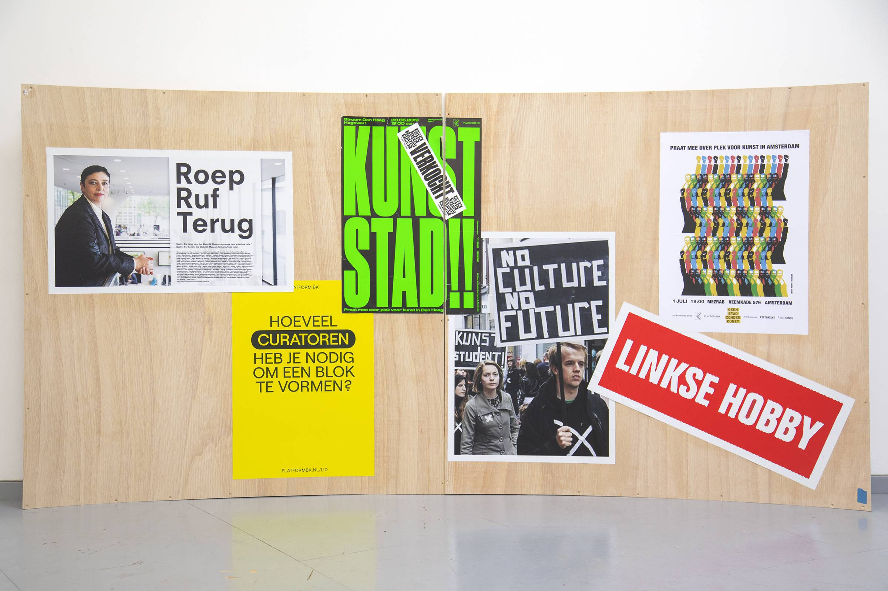

---
Pr-id: INC Theory on Demand #49
P-id: INC Theory on Demand
A-id: 49
Type: article
Book-type: anthology
Anthology item: article
Item-id: unique no.
Article-title: De bevrijding van het mecenaat
Article-status: accepted
Author: Liesbeth Bik, Helleke van den Braber, Timo Demollin, Nous Faes, Roel Griffioen, Anna van Leeuwen, Sofia Patat, Jack Segbars, Renée Steenbergen, Olav Velthuis
Author-email:   corresponding address
Author-bio:  about the author
Abstract:   short description of the article (100 words)
Keywords:   50 keywords for search and indexing
Rights: CC BY-NC 4.0
...

# Het aantal particuliere musea groeit wereldwijd, maar dat maakt kunst ook kwetsbaar

### Anna van Leeuwen in gesprek met Olav Velthuis

Voorlinden in Wassenaar, Museum More in Gorssel, Beelden aan Zee in
Scheveningen: Nederland telt acht particuliere kunstmusea. Het zijn
musea waarin kunstverzamelaars hun collectie tonen, vaak gecombineerd
met wisselende tijdelijke tentoonstellingen. Opvallend: zes van deze
Nederlandse musea zijn in de afgelopen tien jaar geopend. Nederland
staat in deze ontwikkeling niet alleen. Er zijn sinds 2000 wereldwijd
meer dan 300 privémusea geopend. Daarmee staat de teller op 446. Dat
blijkt uit het onderzoek 'Private Museum Research: The Global Rise of
Private Museums for Contemporary Art' van de Universiteit van
Amsterdam.[^10_1]

Kunstcritici en wetenschappers zijn het er niet over eens of die trend
een goede ontwikkeling is. Een positief effect is dat kunstwerken die
anders mogelijk in een kelder of depot zouden blijven aan het publiek
worden getoond. Een keerzijde is dat de smaak van de rijken een stempel
kan drukken op de kunstmarkt en dus de kunstwereld. Bovendien worden
publieke musea door de particuliere nieuwkomers beconcurreerd.

Olav Velthuis, die als hoogleraar economische sociologie de
onderzoeksgroep leidt, ziet nog andere redenen om kritisch te zijn. 'Wij
signaleren verschillende ongelijkheden. Zo zijn het vooral mannen die
musea openen, en dan vooral superrijke mannen in welvarende landen. Zo
staan 37 museumoprichters op de miljardairslijst van *Forbes*, hun
vermogen wordt dus geschat op minstens een miljard dollar. Je kunt
hierdoor spreken over "culturele ongelijkheid".'[^10_2]

Anna van Leeuwen (AvL): Er zullen ook positieve kanten aan deze enorme
groei van musea zitten?

Olav Velthuis (OV): Jazeker, een particulier museum kan een belangrijke
toevoeging aan een kunstlandschap zijn, kunst presenteren op een andere
manier of met een ander thema. Denk aan Museum More voor realistische
kunst, dat is echt een toevoeging. En sommige musea hebben een
toegankelijke kunstcollectie en bieden zo een laagdrempelige
museumervaring.

AvL: En wat beweegt een verzamelaar om een museum te openen?

OV: Dat verschilt per oprichter, vaak is het een combinatie van
factoren. Wat deze mensen gemeen hebben is een passie voor kunst en een
verzameling die hun huis of huizen is ontgroeid. Dan komt er een
filantropisch ideaal bij: 'Ik wil dit moois delen met de samenleving.'
Er zijn ook motieven die meer met eigenbelang te maken hebben: als je
een stichting opricht en de kunstverzameling daarin onderbrengt, levert
dat aanzienlijk belastingvoordeel op. Bovendien maak je jezelf mogelijk
onsterfelijk door je naam aan het instituut te verbinden, dat doet bijna
de helft van de oprichters. Een eigen museum is natuurlijk ook een
statussymbool.[^10_3]

AvL: Het helpt mogelijk ook bij het opbouwen van een collectie, wanneer
je tegen galeries kunt zeggen: 'Ik heb mijn eigen museum.'

OV: Bij de meest exclusieve hedendaagse kunstenaars, waarvoor een
wachtlijst is, heeft een verzamelaar met een museum inderdaad zeker een
streepje voor. Maar we zien dat publieke musea meestal alsnog als eerste
worden bediend. Waarschijnlijk omdat die over het algemeen anders met
hun collectie omgaan: ze zullen kunstwerken niet gauw doorverkopen en
hebben meer aandacht voor conservering en onderzoek.

AvL: Wat voor soort mensen zijn het eigenlijk die particuliere musea
openen, wat is hun achtergrond?

OV: Het gaat over het algemeen om selfmade mannen, vaak uit de industrie
of uit de financiële wereld of het onroerend goed. Het gaat echt om
ondernemers.

AvL: Joop van Caldenborgh van Museum Voorlinden vertelde De Volkskrant
in 2020 dat hij weleens wordt benaderd door bestuurders uit het
buitenland die ook wel een museum met zijn collectie bij hen in de buurt
willen.[^10_4] Waarom zou dat zijn?

OV: Ik kan natuurlijk niet in de hoofden van die bestuurders kijken,
maar een museum kan een snelle en effectieve manier zijn om een stad of
een regio cultureel op de kaart te zetten. En het kan daarmee ook een
economische aanjager zijn voor een gebied.

AvL: Is een particulier museum voor de eeuwigheid?

OV: Uit ons onderzoek blijkt dat ze behoorlijk fragiel zijn, doordat ze
meestal leunen op één individuele verzamelaar. Het is een enorm kostbare
activiteit om een museum te runnen. Als de oprichter komt te overlijden
of er zijn financiële problemen, wat doe je dan? Deze musea krijgen
vrijwel geen overheidssubsidie en ook geen geld van collega-filantropen,
dus ze kunnen nergens om hulp vragen. En de passie voor kunst is ook
niet genetisch overdraagbaar. We hebben schrijnende verhalen gehoord en
hebben 76 privémusea geteld die zijn gesloten. Ik vond dat wel een
belangrijk inzicht: het zijn machtige instellingen, maar ook kwetsbaar.

AvL: Zet die enorme groei van particuliere musea door?

OV: De vaart waarmee nieuwe musea openen, is al aan het afnemen. 2011
was het jaar waarin de meeste openden: 29 stuks, in 2021 waren het er
11. Wat mogelijk meespeelt, is dat er al zo veel particuliere musea
zijn. En ik vermoed dat verzamelaars inmiddels ook zien dat het
bijzonder veel moeite kost om een museum op lange termijn open te
houden.

## Particuliere musea in cijfers 

<table>
    <thead>
        <tr>
            <th colspan="2">Wie begint een particulier museum?</th>
        </tr>
    </thead>
    <tbody>
        <tr style="background:transparent">
            <td>Opgericht door een man</td>
            <td><strong>57,9%</strong></td>
        </tr>
        <tr style="background:transparent">
            <td>Opgericht door een verzamelaarskoppel</td>
            <td><strong>26,6%</strong></td>
        </tr>
        <tr style="background:transparent">
            <td>Opgericht door een vrouw</td>
            <td><strong>15,5%</strong></td>
        </tr>
    </tbody>
</table>

 

<table>
    <tr>
        <td>Gemiddelde leeftijd bij oprichting van het museum</td>
        <td><strong>58 jaar</strong></td>
    </tr>
</table>
 

<table style="border-collapse: collapse">
    <thead>
        <tr>
            <th colspan="2">Waar staat een particulier museum?</th>
        </tr>
    </thead>
    <tbody>
        <tr style="border:1px solid; background:transparent">
            <td colspan="2"><strong>De continenten met de meeste particuliere musea:</strong></td>
        </tr>
        <tr style="background:transparent">
            <td>Europa</td>
            <td><strong>49,8%</strong></td>
        </tr>
        <tr style="background:transparent">
            <td>Azië</td>
            <td><strong>28,0%</strong></td>
        </tr>
        <tr style="background:transparent">
            <td>Noord-Amerika</td>
            <td><strong>14,6%</strong></td>
        </tr>
        <tr style="border:1px solid; background:transparent">
            <td colspan="2"><strong>De landen met de meeste particuliere musea:</strong></td>
        </tr>
        <tr style="background:transparent">
            <td>Duitsland</td>
            <td><strong>60</strong></td>
        </tr>
        <tr style="background:transparent">
            <td>Verenigde Staten</td>
            <td><strong>59</strong></td>
        </tr>
        <tr style="background:transparent">
            <td>Zuid-Korea</td>
            <td><strong>50</strong></td>
        </tr>
    </tbody>
</table>

*Dit artikel werd oorspronkelijk gepubliceerd in* De Volkskrant *van 12
april 2023.*[^10_5]

[^10_1]: Zie: <https://privatemuseumresearch.org/>. Het onderzoek hanteert
    de volgende definitie van een particulier museum: 'Een
    kunstinstelling die in handen is, of wordt geleid door een of
    meerdere particulieren, die geen of amper subsidie krijgt, een
    collectie moderne en/of hedendaagse kunst heeft en doorlopend
    publiekelijk toegankelijk is in een gebouw of fysieke structuur.'

[^10_2]: In het rapport worden ook de genderongelijkheid en geografische
    ongelijkheid van de 'museumboom' getoond. Velthuis e.a., *Beyond the
    Global Boom.*

[^10_3]: Sectie 2 van het onderzoeksrapport, 'The Founders', gaat dieper in
    op het profiel van de oprichters van private musea. Olav Velthuis
    e.a., *Beyond the Global Boom,* pp. 16-28.

[^10_4]: Michiel Kruijt, 'Joop van Caldenborgh: "Als u woorden als genereus
    of gul gebruikt, dan kan ik daarmee leven"', *Volkskrant,* 3
    december 2020,
    <https://www.volkskrant.nl/mensen/joop-van-caldenborgh-als-u-woorden-als-genereus-of-gul-gebruikt-dan-kan-ik-daarmee-leven~ba135e10/>.

[^10_5]: Voor het volledige onderzoeksrapport, zie: Olav Velthuis e.a.,
    *Beyond the Global Boom: Private Art Museums in the 21^10_st^10_ Century*
    (Amsterdam: Universiteit van Amsterdam, 2023),
    <https://privatemuseumresearch.org/report/>[.]{.underline}

